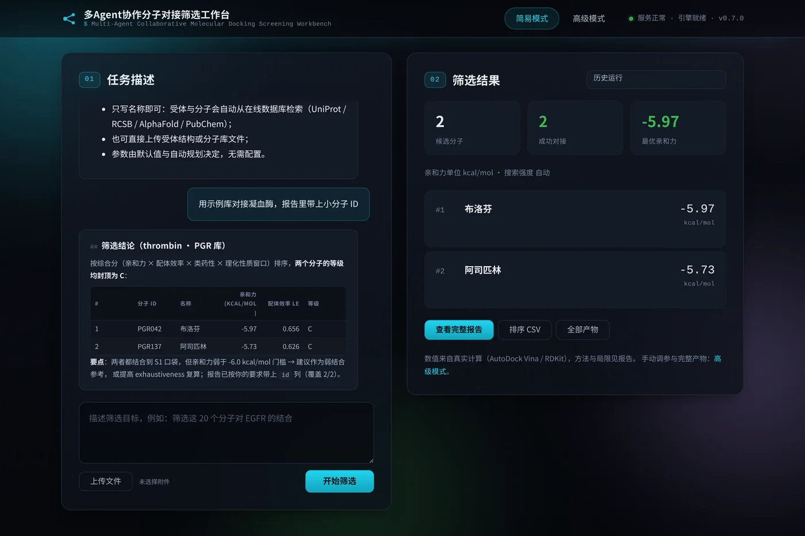

# 分子对接多 Agent 协作系统

**A multi-agent system for molecular docking-based virtual screening and binding-mode assessment**

<https://github.com/yuhao233/Docking-Multi-agent>

从自然语言指令或分子、受体文件出发，完成分子库准备、理化性质评估、结合口袋定盒、真实分子对接、
结合模式比较与推荐排序，输出可逐条核对的筛选报告与完整中间产物。

系统的分工很明确：语言模型负责判断该做什么、按什么顺序做、如何解释结果；数值一律来自计算内核。
亲和力、性质、相似度等指标均可回溯到工具输出与运行目录，模型不参与数值的生成。

`Python 3.12` · `LangChain / LangGraph` · `AutoDock Vina` · `RDKit` · `Meeko` · `GEMMI` · `FastAPI`
· 单机部署 · 离线可用 · 无外部服务依赖

---

## 目录

- [功能范围](#功能范围)
- [系统结构](#系统结构)
  - [代码结构](#代码结构)
- [运行机理](#运行机理)
- [快速开始](#快速开始)
- [使用方式](#使用方式)
- [交互准则](#交互准则)
- [运行记录与可复现性](#运行记录与可复现性)
- [环境依赖与降级策略](#环境依赖与降级策略)
- [质量保障](#质量保障)
- [文档](#文档)
- [引用与许可](#引用与许可)

---

## 功能范围

| 环节 | 实现 | 产出 |
| --- | --- | --- |
| 分子库准备 | 多格式解析（SDF / SMILES / CSV / MOL2）、结构规范化、**按化学身份（规范 SMILES）去重**、ID 与来源记录 | 规范化分子库、来源清单 |
| 配体解析 | 名称 / CID / InChIKey 在线查询（PubChem）；多组分与配位聚合物（如代森锰锌）给出「原始多组分 / 金属-单体 / 最大有机片段」候选由用户点选，选定形式作为请求字段继续 | 参与对接的化学形式、决定留痕 |
| 受体准备 | 上传结构文件，或按 PDB 编号 / UniProt 登录号 / 基因或蛋白名在线解析（UniProt 多策略检索 + RCSB / AlphaFold），现场制备为对接输入（含按目标 pH 质子化） | 对接用受体、结合位点、受体溯源 |
| 口袋与定盒 | P2Rank 或内置几何方法预测口袋，与实验位点比对后选定对接盒；受体自带共晶配体时可作为阳性对照 | 口袋清单、盒子溯源 |
| 理化性质 | RDKit 计算分子量、logP、TPSA、氢键供受体、可旋转键、芳香环与类药性规则；质子化态按目标 pH 由 dimorphite-dl / pdb2pqr 决定 | 性质表、性质分布图 |
| 分子对接 | AutoDock Vina 为主引擎，AutoDock4 备用；大库采用「全库粗筛 → 头部精算」两阶段策略 | 亲和力、配体效率、位姿文件 |
| 结合模式 | 分子指纹、药效团锚定、结构一致性，与阳性对照比较 | 相似度、相互作用二维与三维图 |
| 报告与交付 | 固定九章骨架，可依用户对输出的要求定制（标题、附加列、「本次要求与响应」一节）；全部产物支持单项或整包下载 | 报告、排序表、图表、自包含压缩包 |

## 两套界面

同一个后端契约上有两套界面，顶栏一键互切：

| 界面 | 地址 | 面向 | 形态 |
| --- | --- | --- | --- |
| **简易模式** | `/`（**默认首页**，别名 `/simple`） | 一句话就能跑 | 只有「任务描述 + 筛选结果」两块，零参数表单：质子化态、搜索强度、位点盒全部由默认值与受理层自动规划决定；结果区给前几名、关键指标与报告 / CSV / 整包链接 |
| **高级模式** | `/advanced` | 需要调参、查中间数据 | 三栏工作台：参数表单、对话与结果、运行详情（编排时间轴 / 阶段日志 / 工具轨迹 / 实时逐分子），另有历史检索、报告全文、中间数据与设置页 |



两套界面走同一条标准智能体协议链路与同一批产物接口，因此「简易模式跑出来的结果」与高级模式完全一致，
只是暴露的操作面不同。

## 交互准则

系统的目标是把判断留给用户、把操作留给系统：**只有影响对接本身的问题才需要你决定**，
执行细节一律自动处理。

| 类别 | 例子 | 系统行为 |
| --- | --- | --- |
| 影响对接（会打断） | 受体不可用或存在多个同样合理的候选；多组分分子（如代森锰锌）的代表结构取法；共晶配体是否作阳性对照 | 下发可点选项，**零计算**等你选；选完按同一会话继续 |
| 执行细节（不打断） | 工具/模型瞬时失败；跑满步数上限；同一个问题被重复生成；页面刷新 | 自动重试；自动放宽步数（120 → 240 → 480）并继续，到顶让主管智能体用已有结果收尾；同一问题只问一次、只显示一份；刷新后结果区保持空态、历史随时可载回 |

界面上「等你选择」的运行状态如实标为 `needs_user_input`（`[ ASK ]`），与「未受理、零计算」的
`no_op`（`[ SKIP ]`）区分开。

## 系统结构


系统分六层，依赖单向向下：**接入层**（两套网页界面、标准 Agent Protocol 接口、命令行、LangGraph Studio）、
**受理层**（自然语言与表单 → 结构化任务规约与执行决策）、**编排层**（协调 Agent 与四个子 Agent，
含中间件统一治理）、**运行支撑层**（共享黑板、产物落盘、运行事实、步数预算、事件流、检查点）、
**计算层**（对接、性质、口袋、质子化、结合模式，不依赖语言模型）、**记录层**（运行目录与报告）。
计算层可脱离智能体单独运行，这既是离线能力的基础，也是测试与结果复现的基础。


一个协调 Agent 掌握全部工具，负责决策、分发与汇总；四个子 Agent 分别承担口袋分析、性质评估、
对接执行与结合模式检测，按无状态执行器设计，每次调用使用独立线程。**执行治理对每次模型调用生效**：
中间件负责重试、模型与工具调用限额、长对话摘要与工具调用序列自愈；步数预算在跑满递归上限时自动放宽
并从检查点继续，到顶则让主管 Agent 用已有结果收尾。跨步骤数据分两路交接：受体、位点盒、分子库标识、
阳性对照等小状态写入共享黑板；分子清单、性质与对接明细落盘为运行产物并按路径交接，
因此上万条明细不进入模型上下文。

### 代码结构

| 路径 | 职责 |
| --- | --- |
| `projects/src/docking_agent/api/` | FastAPI 应用、标准 Agent Protocol 面（线程 / 运行 / 助手）、产品接口路由（运行、产物、上传、设置、元信息）与安全守卫 |
| `projects/web/` | 两套界面：`simple.*`（简易模式）、`app.js` + `index.html`（高级模式）、`markdown.js`（共用的 Markdown 渲染器）、`styles.css` |
| `projects/src/docking_agent/intake.py` | 受理层：确定性规则 + 可选模型 → 任务规约（`run` / `ask` / `reject`）、会话继承、在线解析 |
| `projects/src/docking_agent/agents/` | 编排层：`coordinator`、`workers`、`dispatch`（工具→子 Agent）、`middleware`（治理）、`prompt_blocks`（条件纪律段）、`threads`（工具调用序列自愈）、`persistence`（结果合并与落盘） |
| `projects/src/docking_agent/runtime/` | 运行支撑层：`streaming`（事件流）、`blackboard`、`tool_io`、`run_facts`、`limits`（步数预算）、`llm`、`context`、`checkpoints` |
| `projects/src/docking_agent/tools/` | 智能体工具：对接、口袋、性质、结合模式、在线解析、候选选择、报告与推荐、位姿 |
| `projects/src/docking_agent/core/` | 计算内核：化学与结构、Vina 执行、口袋、质子化、受体解析、库归一化、排序、参数 |
| `projects/src/docking_agent/reporting/` | 报告：九章骨架（`report` + 分节模块）、图表、结构卡、表格、PDF、产物清单 |
| `projects/src/docking_agent/runs.py` | 运行记录：目录布局、元数据、日志、中断收尾与历史索引 |
| `langgraph-deploy/` | 平台面：把编排层暴露为六张图，供可视化调试与 SDK 调用 |

## 运行机理


用户输入先经受理层解析为结构化任务规约，给出执行、请求补充或拒绝的决策；后两种情形不调用任何计算工具，
因此不会产生空报告。随后协调 Agent 按规约分发工具，真实计算完成后明细落盘、摘要回传。
界面持续接收文本增量、阶段进展与领域事件：模型的思考单独成轨（折叠进「思考」块，不进正文），
需要用户决定的候选选项在本轮输出结束后才挂出，长任务不会表现为无响应。
跑满步数上限时自动放宽上限并从检查点继续，到顶则让主管 Agent 用已有结果收尾，不会以报错中断。


对接是流程中的时间瓶颈，系统按可用核数规划线程与进程的比例，并在候选规模较大时先做全库粗筛、
再对头部精算，同一分子保留精度更高的一条结果。报告中固定记录实际使用的引擎、搜索强度与盒子来源，
便于确认结论的适用条件。

## 快速开始

```bash
git clone https://github.com/yuhao233/Docking-Multi-agent.git
cd Docking-Multi-agent/projects

bash scripts/doctor.sh          # 环境能力自检：缺什么、缺了会降级成什么
bash start.sh                   # 首次安装依赖并启动服务（默认 http://127.0.0.1:5000）
```

运行需要可用的模型端点（任意 OpenAI 兼容接口），复制 `.env.example` 为 `.env` 后填写。
未配置时环境自检与计算内核仍可使用，但对接流程无法编排执行。`doctor.sh` 退出码 `0` 为全能力、
`2` 为部分降级、`1` 为缺少必需组件。

## 局域网访问

默认只监听本机（`127.0.0.1`）。需要在同一网段的其他机器上使用时，把监听地址改为 `0.0.0.0`
后重启服务：

```bash
cd projects
echo 'HOST=0.0.0.0' >> .env        # 或写入 .env.example 中的 HOST 项
bash start.sh --port 5001 --no-browser
# 其他机器访问：http://<本机局域网 IP>:5001
```

服务没有鉴权机制，开放到局域网意味着同网段内任何机器都可以读取全部运行结果与产物、上传文件、
发起对接任务，并修改设置（其中包含模型端点与密钥）。请只在可信网络中使用；如需跨网段或公网使用，
建议置于反向代理之后并自行添加访问控制。

## 使用方式

### 简易模式（默认首页）

打开服务地址即是：写清目标（例如"筛选这 20 个分子对 EGFR 的结合"或"把拟南芥 ROS1 与代森锰锌对接"），
点「开始筛选」即可。分子与受体可以直接写名称（系统自动从在线数据库检索），也可以上传文件；
不需要配置任何参数。运行中可随时停止，右侧结果区在完成后给出推荐分子、关键指标与产物链接。

### 对话方式（高级模式）


描述目标即可执行，例如"用上传的分子库对接凝血酶，报告里带上小分子 ID"。参数区只下发被改动过的字段，
气泡下方的参数小票如实列出本次下发的参数；受体与分子库可以直接上传，也可以在指令中以 `@文件名` 引用。

回复按 Markdown 渲染（标题、列表、表格、代码块与安全链接），流式阶段就是渲染后的样子；
模型的思考过程收进气泡内默认收起的「思考」块（推理时展开可见，正文一开始就自动收起并记用时），
助手回执本身**不做默认折叠**。需要你决定时，候选选项会等**本轮输出结束**再挂出，避免与进行中的运行抢跑。

### 参数方式与结果（高级模式）

参数方式以表单为权威输入，可显式指定受体、位点盒、分子库、引擎、搜索强度、输出位姿数、质子化态策略与阳性对照。


结果区给出关键指标、运行笔记、可排序分页的推荐排行与逐分子结构卡；报告采用固定骨架，
第 3 章中每个推荐分子附二维结构与关键指标。


界面为三栏：左栏参数设置，中栏对话与结果，右栏运行详情（编排时间轴、阶段日志、工具轨迹、
实时逐分子结果），左右栏可收起，窄屏自动降级排布。

### 历史运行

运行记录按次落盘并持久保存，关闭页面后仍可检索之前的运行：支持按关键词（运行编号、受体、
分子名称或编号）、状态、类型、受体与时间范围查询并分页，点选即载入该次运行的结果、报告与中间数据。

### 接口与平台

服务启动后即暴露 HTTP 接口（默认仅监听本机）：**产品接口** `/api/...` 承载业务与产物访问，
**运行接口** `/threads`、`/runs`、`/assistants` 遵循标准智能体协议，用于发起与跟踪运行；两者
共享同一套编排与计算实现。命令行入口与计算内核的库调用同样可用。

| 分组 | 代表端点 | 用途 |
| --- | --- | --- |
| 运行 | `POST /threads/{id}/runs/stream`、`/runs/wait`、`.../cancel` | 发起、等待与取消一次运行（事件流含文本增量、阶段进展与逐分子结果） |
| 助手 | `GET /assistants/search`、`/assistants/{id}/schemas` | 列出助手与其输入输出结构 |
| 历史 | `GET /api/runs`（支持 `q` / `status` / `receptor` / `since` / `until` / 分页） | 运行检索，关闭页面后仍可查回 |
| 产物 | `GET /api/runs/{id}/report.pdf`、`/export.csv`、`/poses.zip`、`/download.zip` | 报告、排序表、位姿与整包下载 |
| 输入 | `POST /api/uploads`、`GET /api/libraries`、`/api/receptors` | 上传与登记受体、分子库 |
| 配置 | `GET/PUT /api/settings`、`POST /api/tools/probe` | 设置读写与外部工具探测 |

```bash
curl -s -X POST localhost:5000/threads -H 'Content-Type: application/json' -d '{}'   # 建会话
curl -N -X POST localhost:5000/threads/<thread_id>/runs/stream \
     -H 'Content-Type: application/json' \
     -d '{"assistant_id":"coordinator","stream_mode":["messages","updates","custom"],
          "input":{"mode":"chat","message":"用示例库对接凝血酶前 5 个分子"}}'
curl -s "localhost:5000/api/runs?q=阿司匹林&status=ok&limit=20"                        # 检索历史
```

完整端点清单、字段与事件流帧格式见 [`projects/docs/api.md`](projects/docs/api.md)。

`langgraph-deploy/` 目录把编排层暴露为六张图，可在可视化调试环境中查看状态与中断，或通过平台 SDK 调用。

## 运行记录与可复现性

```
var/runs/<run_id>/
├── run.json            运行元数据与产物清单
├── request.json        请求原文          ├── result.json        完整结果
├── ranking.csv/.json   排序结果          ├── molecules.json     分子库与来源
├── properties.json     理化性质          ├── docking.json       对接明细与参数留痕
├── pockets.json        口袋与盒子溯源    ├── blackboard.json    共享状态快照
├── report.md / .pdf    规范报告          ├── charts/            结构卡与对比图
├── poses/              配体位姿          └── receptor/          对接实际使用的受体结构
```

运行目录自包含，可整目录迁移或离线查看。同一随机种子下，单分子得分不依赖批次组成与并行方式，
因此可用相同输入与参数复算并逐条比对。

## 环境依赖与降级策略

| 组件 | 必要性 | 缺失时的行为 |
| --- | --- | --- |
| Python 3.12、RDKit、Vina 绑定、Meeko、FastAPI、Matplotlib | 必需 | 自检失败并给出安装命令 |
| 工作目录可写 | 必需 | 自检失败，需修正权限或指定工作区 |
| 模型端点 | 必需 | 无法编排对接；环境自检与计算内核仍可用 |
| Java 运行时与 P2Rank | 可选 | 口袋分析使用内置几何方法 |
| pdb2pqr | 可选 | 受体不按目标 pH 重新分配质子化态，报告注明 |
| AutoDock4 | 可选 | 仅保留主引擎 |
| 中文字体 | 可选 | 图表与 PDF 中的中文可能显示异常 |
| GPU 对接引擎 | 可选 | 由用户提供可执行文件并在设置中登记；登记后不可用时任务直接失败并提示，不回退 |

## 质量保障

| 检查 | 内容 |
| --- | --- |
| `pytest` | 计算内核、智能体契约、受理与继承、报告版式与 golden、接口协议、候选生命周期、工具调用序列自愈、步数预算、身份去重、安全边界、运行记录损坏与保留策略等，本机全量 **811 项**通过（多数用例可离线运行） |
| `projects/scripts/check.sh --static` | 五道静态门禁一次跑完：lint（手写 AST 检查 + 基线棘轮）、ruff、mypy（渐进白名单）、界面契约（`check_web.py`，239 项）、安全姿态 |
| `projects/scripts/check.sh --fast` | 与 CI 等价的离线快跑：跳过需要本机引擎的用例（563 通过 / 248 跳过，约 20 秒） |
| `projects/scripts/ui_e2e.js` | DOM 级端到端（230 项，jsdom + 真实后端）：对话、参数、结果、设置、协议帧、两套界面 |
| `projects/scripts/browser_check.py` | 真实浏览器（85 项）：标准协议请求形状、Markdown 渲染、思考折叠、候选点选时机与运行态、报告版式；候选交互另有 `browser_choice_checks.py` |
| `projects/scripts/snapshot_ids.py diff` | 界面 id 基线（244 个）：改动前端结构时防止契约被误删 |
| `tests/test_docs_consistency.py` | 文档一致性：`.env.example` 登记所有被读取的环境变量；技术文档与技术报告必须由当前 Markdown 重新生成（内容哈希核对） |
| `langgraph-deploy/scripts/check.sh` · `test.sh` | 部署面：依赖清单一致性、每张图真实加载、部署层用例 |
| `.github/workflows/gate.yml` | 以上门禁在每次推送与 PR 自动执行（静态门禁 + 离线用例 + 部署自检） |

## 文档

| 文档 | 内容 |
| --- | --- |
| [`docs/技术文档.md`](docs/技术文档.md) · [PDF](docs/技术文档.pdf) · [Word](docs/技术文档.docx) | 框架、运行原理、使用说明（含结构图、数据流图与界面图；由 `projects/scripts/build_tech_doc_pdf.py` 生成） |
| [`projects/README.md`](projects/README.md) | 工程主文档：安装、配置、接口速查、运行记录格式与门禁验收 |
| [`projects/CHANGELOG.md`](projects/CHANGELOG.md) | 修复日志：早期 62 条按时间编号，近期按日期分节记录缺陷复盘与验证方式 |
| [`projects/docs/architecture.md`](projects/docs/architecture.md) | 架构与设计决策、非目标与硬约束（AI 开发手册） |
| [`projects/docs/adr/`](projects/docs/adr/README.md) | 架构决策记录（含索引与模板） |
| [`projects/docs/api.md`](projects/docs/api.md) | HTTP 接口契约与流式帧格式（完整端点、字段与错误语义） |
| [`CONTRIBUTING.md`](CONTRIBUTING.md) · [`SECURITY.md`](SECURITY.md) | 怎么改、改完跑哪些门禁 / 安全模型与漏洞报告方式 |

## 引用与许可

本项目以 **AGPL-3.0-or-later** 发布，全文见 [`LICENSE`](LICENSE)。选择强著佐权协议的考虑是：
系统允许被改造后作为网络服务对外提供，AGPL 的网络条款要求此类服务同样开放修改后的源码。
学术使用不受限制；如需在闭源产品中集成，请与作者联系获取商业许可。

本仓库提供 [`CITATION.cff`](CITATION.cff)，GitHub 页面右上角会显示 “Cite this repository”，
可直接导出 BibTeX 或 APA 条目；使用本系统开展研究时，请引用本仓库，并按报告列出的工具与版本引用相应工具的文献。
依赖组件与本项目许可不冲突：多为宽松许可（Apache-2.0、BSD-3-Clause、MIT），部分为弱著佐权许可
（LGPL-2.1、MPL-2.0）。外部工具（P2Rank、pdb2pqr、AutoDock4、GPU 对接引擎）不随仓库分发，
需用户自行安装并遵循其原始许可。
