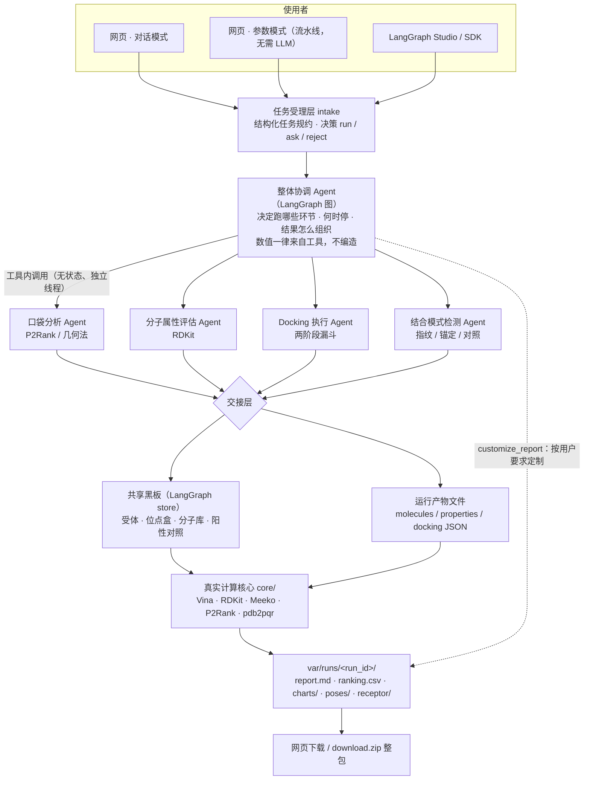

# Docking-Multi-agent · 分子对接多 Agent 协作系统

**From natural language to a reproducible docking report** — 从一句指令或一份分子/受体文件，
自动跑到可追溯的对接排序、专家报告与全套中间产物。

`Python 3.12` · `LangGraph / LangChain` · `AutoDock Vina` · `RDKit` · `Meeko` · `P2Rank`
· `FastAPI + 原生 JS 前端` · **本地优先 / 离线可用 / 无外部服务依赖**

> 所有数值都来自**真实计算**（Vina 打分、RDKit 性质、P2Rank 口袋），并且逐条可回溯到
> 工具输出与运行产物；任何降级（缺 P2Rank / pdb2pqr / AutoDock4 / 字体）都会**写进报告**，不静默。

---

## 目录

- [它能做什么](#它能做什么)
- [架构：Agent 如何协作](#架构agent-如何协作)
- [快速开始](#快速开始)
- [使用教程](#使用教程)
  - [① 对话模式](#-对话模式自然语言)
  - [② 参数模式](#-参数模式表单即权威跨模式)
  - [③ 结果与报告](#-结果与报告)
  - [④ 按你的要求定制报告](#-按你的要求定制报告agent-的主观能动性)
  - [⑤ 中间数据与整包交付](#-中间数据与整包交付)
  - [⑥ LangGraph Studio / SDK](#-langgraph-studio--sdk平台面)
  - [⑦ API 与命令行](#-api-与命令行)
- [运行产物长什么样](#运行产物长什么样)
- [环境能力矩阵](#环境能力矩阵缺什么降级成什么)
- [配置](#配置)
- [常见问题](#常见问题)
- [质量门禁](#质量门禁)
- [项目结构与文档导航](#项目结构与文档导航)

---

## 它能做什么

| 能力 | 实现 | 产出 |
| --- | --- | --- |
| **分子筛选（核心）** | 蛋白质受体 × 小分子库的**真实对接**（Vina 主 / AutoDock4 备） | 亲和力排序、推荐排行、排序 CSV |
| **受体解析** | 预置受体注册表（已知结合位点）/ 上传 PDB·CIF·PDBQT / 在线解析（PDB 号、UniProt、基因名） | 现场准备 PDBQT + 结合位点 |
| **口袋与定盒** | P2Rank（可选）或内置几何法预测口袋 → 与实验位点比对 → 选定对接盒并记录来源 | 口袋表、盒子溯源、2D/3D 示意 |
| **物化性质与类药性** | RDKit 真实计算（MW / logP / TPSA / HBD / HBA / 可旋转键 / 芳香环 / Lipinski） | 性质表 + 空间图 |
| **质子化态** | 运行级策略：`ph`（按目标 pH 规则近似）/ `neutralize` / `keep`，性质与对接**同口径** | 逐分子净电荷与命中规则 |
| **结合模式分析** | Morgan + MACCS 双指纹、药效团锚定、结构一致性，与阳性对照比较 | 相似度、相互作用 2D/3D 图 |
| **报告与交付** | 固定骨架 §1–§9 + **协调 Agent 按你要求定制的一节** | `report.md` / `report.pdf` / 中间数据 / 整包 ZIP |

---

## 架构：Agent 如何协作

**「整体协调 Agent」只做决策与调度，不做计算**；4 个子 Agent 是**无状态执行器**（每次调用独立线程）；
真实计算全部落在 `core/`（零 LLM 依赖）；跨步骤交接走**共享黑板（小状态）+ 运行产物文件（大表）**。


<details>
<summary>同一张图的 Mermaid 版本（便于查看/复制）</summary>



</details>

一次运行里「谁在什么时候做什么」：


> 两条硬规则（详见 [`docs/adr/0001-agent-surface.md`](projects/docs/adr/0001-agent-surface.md)）：
> **Agent 编排能力只写在 `agents/`、`tools/`（产品面与平台面共用，禁止复制）**；
> **协议形状（SSE 帧、run_id 语义、取消）只实现一份**。

---

## 快速开始

```bash
git clone <本仓库地址> && cd Docking-Multi-agent/projects

bash scripts/doctor.sh     # ① 能力自检：有什么、缺什么、缺了会降级成什么
bash start.sh              # ② 装依赖（首次几分钟）→ 起服务 → 打开网页
```


- 服务地址：`http://127.0.0.1:5000`（端口被占用会自动顺延，`start.sh --port 8000` 可指定）
- 多 Agent 模式需要 LLM：`cp .env.example .env` 后填 `LLM_API_KEY` / `LLM_BASE_URL`（任意 OpenAI 兼容端点）；
  **不配 LLM 也能用** —— 参数模式的确定性流水线照常工作。
- 其他入口：`bash start.sh --check`（能力自检 + 真实小分子对接冒烟）· `--no-browser` · `--setup`

---

## 使用教程

### ① 对话模式（自然语言）

在输入框里直接描述目标，例如：

```
用刚上传的库对接受体 thrombin，对接盒 center=31.5,13.74,24.36 / size=22,22,22，
exhaustiveness=1、n_poses=1，报告里带上小分子的 ID。直接执行，不要问我。
```

要点：

- **参数条只下发你改动过的项**（未改动 = 系统默认/自动规划）；气泡里的小票会如实列出"本次下发参数"，
  什么都没改就显示「纯指令」。
- **附件**：拖入或点「附件」上传受体（`.pdb/.ent/.cif/.pdbqt`）与分子库（`.sdf/.smi/.csv/.mol2/.xlsx`），
  也可在指令里用 `@文件名` 引用已上传文件；上传的原件与准备产物都会进运行目录。
- **受体从哪来**：没指定 → 系统默认受体（报告会写明是哪个）；点名了（如 `EGFR` / `P08922`）→
  自动在线解析（UniProt → RCSB / AlphaFold），有歧义时给出可点选的候选，不替你决定。
- **运行时**：可随时「停止」（协作式取消，会中断对接进程池）；「运行详情」默认收起，开跑自动展开。

### ② 参数模式（表单即权威，跨模式）

切到「参数模式」：受体 / 位点盒 / 分子库 / 引擎 / 搜索强度 / 位姿数 / 质子化态 / 阳性对照 全部显式，
可选**确定性流水线**（不需要 LLM，结果可复算）或**多 Agent 协作**。

- 一键预设：快速初筛 `exhaustiveness=4` / 平衡 `16` / 高精度 `32+n_poses=3`；
- 大库自动走**两阶段漏斗**：全库粗筛 → 头部精算（同一分子保留精度更高的那条）；
- 位点盒留空 → 由口袋分析 Agent 定盒；阳性对照留空 → 跳过对照分析（报告写明）。

### ③ 结果与报告


结果总览给出 KPI（分子数 / 命中 / 最佳 / 失败 / 耗时）、运行笔记（默认折叠两行，可展开）、
可排序分页的排序推荐表；「分子详情」是带 2D 结构图的卡片流。

报告是**固定骨架 §1–§9**（参数与溯源 / 排序 / 推荐 / 性质 / 结合模式 / 方法与局限 / 失败与跳过 /
结论 / 产物清单），其中第 3 章每个推荐分子都附**「2D 结构 + 关键指标」卡片**：


### ④ 按你的要求定制报告（Agent 的主观能动性）

报告不该是死模板。协调 Agent 有一个工具 **`customize_report`**：它会解析你对**输出**的要求，
在骨架不变的前提下调整标题、追加列、给出要点，并把「你的要求 → 实际怎么处理」写进报告第 0 节。

> 例：你说「报告里带上小分子的 ID」→ 报告第 0 节出现一行
> **要求**「报告中带上小分子 ID」→ **处理**「已启用 id 列，按上传文件 ID 列展示（覆盖 2/2）」，
> 且第 3.1 节排行表与结构卡里都带上了 `PGR137` / `PGR042`。
> 若文件里根本没有 ID 字段，工具会回绝并给出覆盖率（如 `0/2`），Agent 必须如实告诉你 —— 不许假装生效。

可定制的字段（白名单，均为真实字段）：`id / name / smiles / formula / molecular_weight / logP / tpsa /
hbd / hba / rotatable_bonds / aromatic_rings / lipinski_violations / drug_likeness_pass /
affinity_kcal_mol / ligand_efficiency / composite / grade / engine / exhaustiveness / box_group /
similarity_to_positive_control / maccs_tanimoto / structural_consistency / anchor_match /
source_index / source_file`。

### ⑤ 中间数据与整包交付


每个产物都能单独下载：报告 `report.md` / `report.pdf`、排序 `ranking.csv`（**含分子 ID**）、
`molecules/properties/docking/pockets/result` JSON、图表（结构卡 / 2D·3D 姿态 / 对比图）、位姿 `poses/`、
**受体结构 `receptor/`**（对接实际使用的 PDBQT + 准备后 PDB + 原始上传文件）。
「打包下载」给出**自包含的整包 ZIP**：换台机器也能复现这次对接。

### ⑥ LangGraph Studio / SDK（平台面）

```bash
cd langgraph-deploy
bash scripts/dev.sh          # 起 LangGraph Agent Server（默认 :2024）
```

`langgraph.json` 暴露 **7 张图**：`coordinator`、`pipeline`、`intake`、`property`、`pocket`、`docking`、`binding`
（复用同一份项目源码；Studio 里可直接对话、看状态与中断）。用途与边界见
[ADR-0001](projects/docs/adr/0001-agent-surface.md)：**产品面**服务本机网页与脚本，**平台面**服务
Studio / SDK / 未来的计划化运行。

### ⑦ API 与命令行

```bash
# 确定性流水线（无 LLM，最适合批处理与复算）
cd projects
.venv/bin/python -m docking_agent -m pipeline -i "乙醇:CCO,苯酚:Oc1ccccc1" \
    --receptor thrombin --max-ligands 10

# HTTP：产品面（产物 / 报告 / 上传 / 设置 / 历史）
curl -s localhost:5000/api/health
curl -s localhost:5000/api/runs | head -c 300

# HTTP：Agent 运行（标准 Agent Protocol 兼容子集）
curl -s -X POST localhost:5000/threads -H 'Content-Type: application/json' -d '{}'
curl -N -X POST localhost:5000/threads/<thread_id>/runs/stream \
     -H 'Content-Type: application/json' \
     -d '{"assistant_id":"coordinator","stream_mode":["messages","updates","custom"],
          "input":{"mode":"chat","message":"用示例库对接 thrombin 前 5 个分子"}}'
```

完整端点与帧格式见 [`projects/docs/api.md`](projects/docs/api.md)。

---

## 运行产物长什么样

```
var/runs/<run_id>/                     # ← 自包含：整目录拷走即可离线复看/复现
├── run.json                 # 运行元数据 + 产物清单（状态、参数、notes、artifacts、定制项）
├── request.json             # 本次请求原文
├── result.json              # 完整结果（ranking / receptors / pockets / task_spec …）
├── ranking.csv / .json      # 排序结果（CSV 开头带 id 列）
├── molecules.json           # 分子库（含来源文件与序号）
├── properties.json          # 理化性质（RDKit）
├── docking.json             # 对接明细（含能量项、盒子来源、参数留痕）
├── pockets.json             # 口袋预测与对接盒溯源
├── blackboard.json          # 多 Agent 共享黑板快照（谁留下了什么）
├── agent_report.md          # 协调 Agent 原始输出
├── report.md / report.pdf   # 规范报告（固定骨架 + Agent 定制节）
├── charts/                  # 结构卡、2D/3D 姿态、亲和力/相似度/性质图
├── poses/                   # 配体位姿 pose_*.pdbqt
└── receptor/                # 对接实际使用的受体（.pdbqt + 准备后 .pdb + 原始文件）
```

---

## 环境能力矩阵（缺什么 → 降级成什么）

`bash scripts/doctor.sh` 会逐项体检并给出「影响 + 补齐命令」，退出码 `0` 全能力 / `2` 仅降级 / `1` 缺必需：

| 组件 | 必需 | 缺失后的行为 |
| --- | --- | --- |
| Python 3.12+、`rdkit`/`vina`/`meeko`/`fastapi`/`uvicorn`/`pydantic`/`matplotlib` | ✅ | `doctor.sh` 退出码 1 → `bash start.sh --setup` |
| `var/`、`assets/` 可写 | ✅ | 退出码 1（检查目录权限 / `DOCKING_WORKSPACE`） |
| Java（JRE 8+） | 可选 | P2Rank 无法运行 → 口袋分析用**内置几何法** |
| P2Rank | 可选 | 同上；`bash scripts/fetch_tools.sh` 或设 `P2RANK_HOME`（工具包 290 MB，不入库） |
| pdb2pqr | 可选 | 受体**不按目标 pH 重算**质子化态（报告告警）；设 `PDB2PQR_BIN` |
| AutoDock4 / autogrid4 | 可选 | 只有 Vina 可用 |
| 中文字体（Noto CJK） | 可选 | 图表 / PDF 中文可能方块 |
| LLM（`LLM_API_KEY` + `LLM_BASE_URL`） | 可选 | 仅确定性流水线可用 |
| 默认端口 5000 | 可选 | `start.sh` 自动顺延到下一个可用端口 |

**离线可用**：确定性流水线 + 注册表受体（thrombin / trypsin）+ 上传文件即可跑通；
只有"在线解析受体 / 按名称查分子 / 云端 LLM"需要网络。

---

## 配置

`cp .env.example .env` 后按需修改（**设置页面**里改的项写入 `config/local_settings.json`，优先级见设置页）：

| 变量 | 说明 |
| --- | --- |
| `LLM_API_KEY` / `LLM_BASE_URL`（及各角色 `LLM_*_<ROLE>`） | LLM 端点与密钥（多 Agent 模式必需） |
| `PORT` / `HOST` | 服务端口与监听地址（默认 `127.0.0.1:5000`，仅本机） |
| `DOCKING_MAX_LIGANDS` / `UPLOAD_MAX_MB` | 单次对接分子上限 / 上传体积上限 |
| `EXHAUSTIVENESS` / `N_POSES` / `ENGINE` | 对接默认参数（界面改过则以界面为准） |
| `P2RANK_HOME` / `PDB2PQR_BIN` | 可选外部工具的显式路径 |
| `CHECKPOINT_BACKEND=sqlite` | 多轮会话跨重启持久化（默认内存） |
| `DOCKING_WORKSPACE` | 工作区根目录（换机器/换盘时整体搬迁） |

---

## 常见问题

**Q：没配 LLM 能用吗？** 能。参数模式选「确定性流水线」，全流程不需要 LLM；对话模式才需要 Agent 决策。

**Q：报告里的数值可信吗？** 全部来自工具真实返回（Vina 打分 / RDKit 性质 / P2Rank 口袋），
报告第 1 节记录参数与溯源、第 9 节列产物清单；`ranking.csv` 与 JSON 可逐条核对。Agent 只写文字判断，不改数值。

**Q：为什么有些分子被"封顶为 C 级"？** 亲和力弱于门槛（默认 −6 kcal/mol）的分子即使其它分量满分也封顶，
避免"小而类药但没结合强度"的分子被推荐；口径写在报告第 3.1 节。

**Q：大库很慢？** 系统自动走两阶段漏斗（粗筛 → 头部精算）并按 CPU/内存规划进程×线程；
也可用界面「最大分子数」或 `--max-ligands` 先做小样本。

**Q：点了停止，为什么还有进程在跑？** 取消是协作式的：会立即终止对接进程池；
若服务被 `kill -9`，孤儿 worker 可能残留 —— `bash scripts/kill_leftovers.sh --dry-run` 查看，去掉 `--dry-run` 清理。

**Q：中文在图里变方块？** 装中文字体：`apt-get install fonts-noto-cjk`（`doctor.sh` 会提示）。

**Q：换机器怎么搬？** `bash scripts/pack.sh` 打源码包（约 5 MB，`--list` 预演内容）；
历史运行直接拷 `var/runs/`（自包含）；`assets/receptors/registry` 已随仓库提供。

---

## 质量门禁

| 门禁 | 内容 |
| --- | --- |
| `pytest` | 590+ 项：计算核心、多 Agent 契约、报告版式、标准协议面、打包与自检（多数离线可跑） |
| `scripts/lint_local.py` | 静态规范（返回类型 / 静默异常 / 裸环境变量 / 文件规模） |
| `scripts/check_web.py` | 前端静态校验（DOM 契约、设计令牌、无外部依赖） |
| `scripts/ui_e2e.js` | jsdom DOM 级端到端（对话 / 参数 / 结果 / 设置 / 标准协议帧） |
| `scripts/browser_check.py` | 真实 Chromium：标准协议请求形状、报告版式、布局与折叠 |
| `langgraph-deploy/scripts/check.sh` + `smoke.py` | 平台面图谱、依赖一致性、含协调 Agent 的端到端冒烟 |

---

## 项目结构与文档导航

```
.
├── README.md                    # ← 你在这里
├── docs/images/                 # 架构图（脚本生成）与界面截图（可复现抓取）
├── projects/                    # 产品面：后端 + 前端 + 脚本 + 文档
│   ├── README.md                # ★ 主文档（快速开始 / 界面 / 配置 / 运行记录 / 改造记录）
│   ├── scripts/doctor.sh        # 环境能力自检      scripts/pack.sh      交付打包（--list 预演）
│   ├── scripts/fetch_tools.sh   # 可选工具（P2Rank） scripts/render_architecture.py  架构图渲染
│   ├── src/docking_agent/       # core/（真实计算）· agents/（多 Agent 编排）· api/ · reporting/
│   ├── web/                     # 原生 JS 前端（无构建、无 CDN）
│   ├── tests/                   # 590+ 项测试
│   └── docs/                    # api.md · architecture.md · adr/ · 技术报告
└── langgraph-deploy/            # 平台面：7 张图（Studio / SDK）与部署脚本
```

| 想了解 | 看这里 |
| --- | --- |
| 快速开始 / 全部配置 / 改造记录 | [`projects/README.md`](projects/README.md) |
| 架构与设计决策（含非目标与硬约束） | [`projects/docs/architecture.md`](projects/docs/architecture.md) |
| 产品面 / 平台面的边界（为什么是两套） | [`projects/docs/adr/0001-agent-surface.md`](projects/docs/adr/0001-agent-surface.md) |
| HTTP API 契约与 SSE 帧格式 | [`projects/docs/api.md`](projects/docs/api.md) |

---

## 说明

- 架构图由 `projects/scripts/render_architecture.py` 生成、界面截图由
  `projects/scripts/capture_readme_shots.py` 抓取（均为真实前端 + 真实运行数据），随代码演进一条命令重画。
- 本仓库**不含**运行历史、缓存、用户上传、外部工具与密钥（见 `.gitignore`）；
  `var/runs/<run_id>/` 是自包含的运行记录，可整目录迁移。
- 许可证：尚未指定。若需开源分发，请补充 `LICENSE`（MIT / Apache-2.0 等）。
