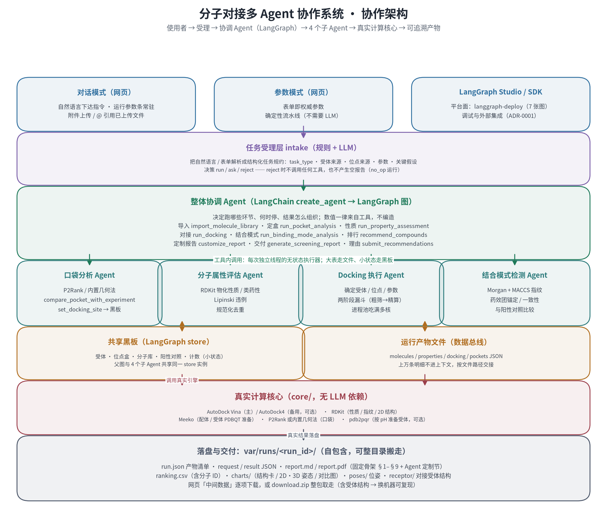
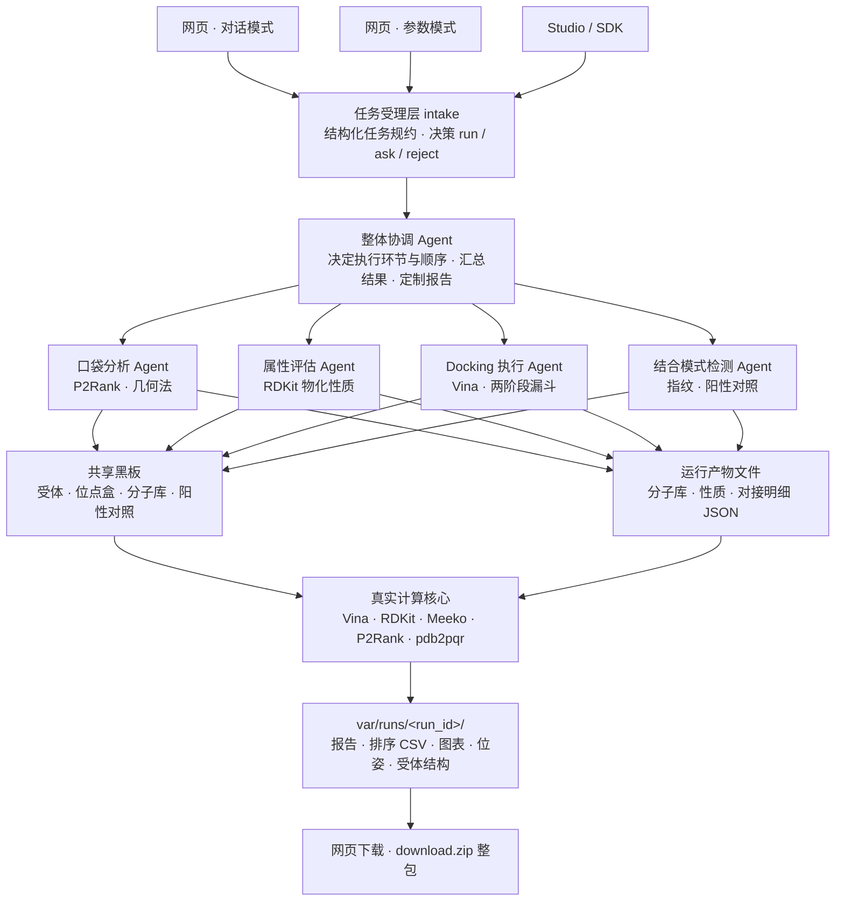
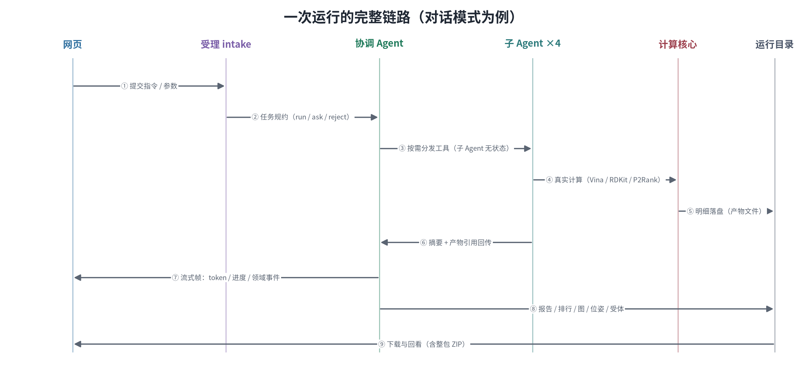
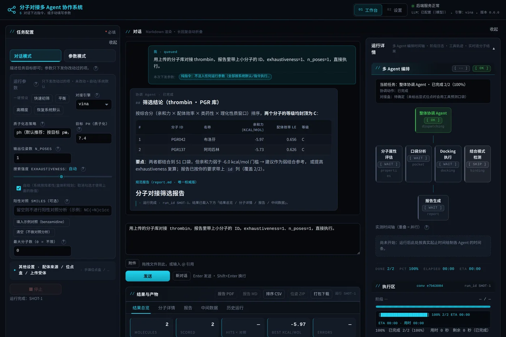
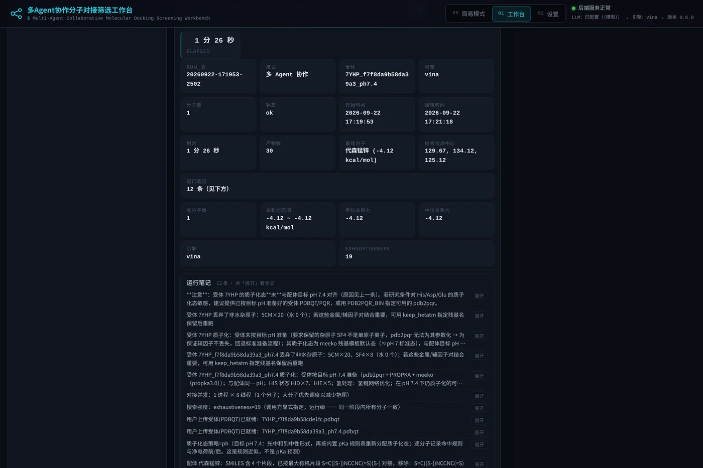
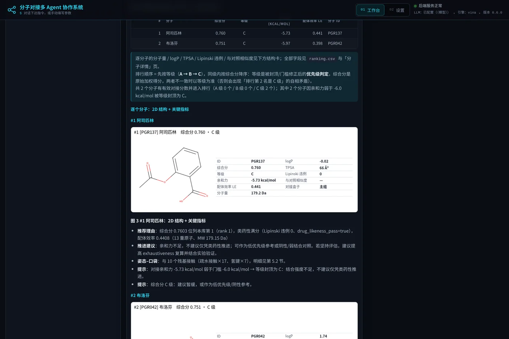
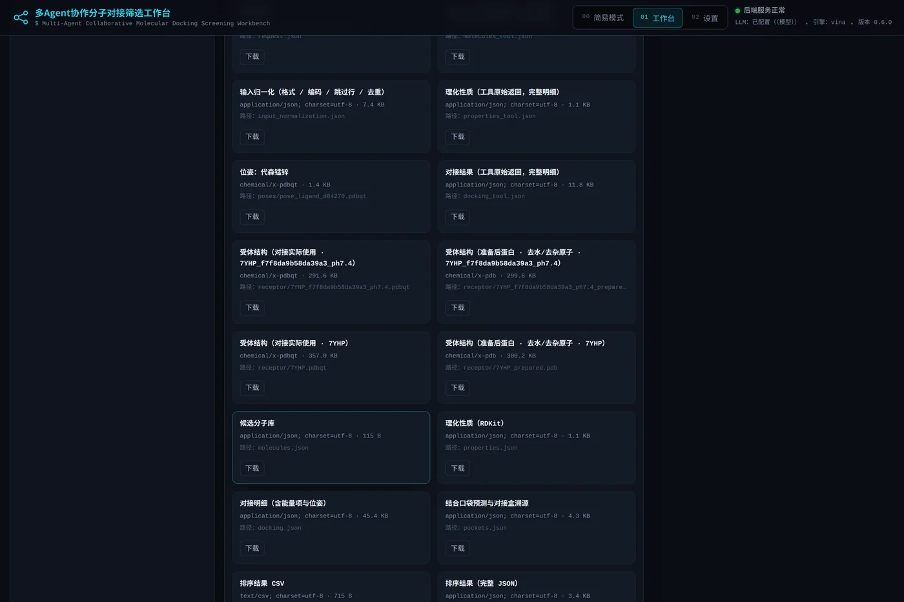

# Docking-Multi-agent · 分子对接多 Agent 协作系统

从自然语言指令或分子、受体文件出发，自动完成分子库导入、物化性质评估、结合口袋定盒、
真实对接打分、结合模式分析与推荐排行，输出可追溯的专家报告与全套中间产物。

`Python 3.12` · `LangGraph / LangChain` · `AutoDock Vina` · `RDKit` · `Meeko` · `P2Rank`
· `FastAPI` + 原生 JS 前端 · 本地优先 · 离线可用 · 无外部服务依赖

所有数值来自真实计算，可回溯到工具输出与运行产物。缺失可选组件时系统按既定策略降级，
并把降级事实写入报告。

## 目录

- [功能范围](#功能范围)
- [系统架构](#系统架构)
- [快速开始](#快速开始)
- [使用教程](#使用教程)
- [运行记录结构](#运行记录结构)
- [环境依赖与降级](#环境依赖与降级)
- [配置](#配置)
- [常见问题](#常见问题)
- [质量门禁](#质量门禁)
- [项目结构](#项目结构)

## 功能范围

| 能力 | 实现 | 产出 |
| --- | --- | --- |
| 分子筛选 | 蛋白质受体 × 小分子库真实对接，Vina 主引擎、AutoDock4 备用 | 亲和力排序、推荐排行、排序 CSV |
| 受体解析 | 预置受体注册表、上传 PDB / CIF / PDBQT、在线解析 PDB 号 / UniProt / 基因名 | 现场准备 PDBQT、结合位点 |
| 口袋与定盒 | P2Rank 或内置几何法预测口袋，与实验位点比对后选定对接盒 | 口袋清单、盒子溯源、2D/3D 示意 |
| 物化性质与类药性 | RDKit 计算分子量、logP、TPSA、HBD、HBA、可旋转键、芳香环、Lipinski 违例 | 性质表、性质空间图 |
| 质子化态 | 运行级策略 `ph` / `neutralize` / `keep`，性质与对接同口径 | 逐分子净电荷与命中规则 |
| 结合模式分析 | Morgan 与 MACCS 双指纹、药效团锚定、结构一致性，与阳性对照比较 | 相似度、相互作用 2D/3D 图 |
| 报告与交付 | 固定骨架 §1–§9，协调 Agent 按用户要求定制其中内容 | `report.md`、`report.pdf`、中间数据、整包 ZIP |

## 系统架构



整体协调 Agent 负责决策与调度：判断任务可否执行、需要哪些环节、何时停止、结果如何组织，
不参与数值计算。四个子 Agent 是无状态执行器，每次调用使用独立线程，可并行下发。
真实计算集中在 `core/`，不依赖 LLM；对接编排由协调 Agent 驱动，因此运行需要可用的 LLM 端点。

跨步骤交接分两路：受体、位点盒、分子库、阳性对照等小状态写入共享黑板；
分子库、性质、对接明细等大表落盘为运行产物文件，按路径交接，不进入模型上下文。

<details>
<summary>Mermaid 版本</summary>



</details>

一次运行的完整链路：



Agent 能力只实现在 `agents/` 与 `tools/`，产品面与平台面共用同一份代码；
协议形状只实现一份。边界定义见 [ADR-0001](projects/docs/adr/0001-agent-surface.md)。

## 快速开始

```bash
git clone <本仓库地址> && cd Docking-Multi-agent/projects

bash scripts/doctor.sh
bash start.sh
```

`doctor.sh` 检查环境能力并列出缺失项的影响，退出码 `0` 为全能力、`2` 为部分降级、`1` 为缺少必需组件。
`start.sh` 首次运行时创建虚拟环境并安装依赖，随后启动服务并打开 `http://127.0.0.1:5000`。
端口被占用时自动顺延，也可用 `--port` 指定。

运行需要 LLM：复制 `.env.example` 为 `.env`，填写 `LLM_API_KEY` 与 `LLM_BASE_URL` 即可接入任意
OpenAI 兼容端点。未配置 LLM 时环境自检与核心计算库仍可用，但对接流程无法编排执行。

其他入口：`bash start.sh --check` 执行能力自检与一次真实小分子对接，`--no-browser` 不打开浏览器，
`--setup` 强制重装依赖。



## 使用教程

### 1. 对话模式

在输入框描述目标即可，例如：

```
用上传的分子库对接 thrombin，报告带上小分子 ID；exhaustiveness=1、n_poses=1。
```

运行参数条只下发被改动过的项，未改动项按系统默认或自动规划执行；气泡中的参数小票如实列出
本次下发的字段，未改动时显示为纯指令。上传受体与分子库可拖拽、点「附件」，或在指令中用
`@文件名` 引用。未指定受体时使用系统默认受体，报告会写明具体受体；点名受体时系统自动在线解析，
存在多个合理候选时给出可点选的选项。

运行期间可随时停止，取消会中断对接进程池并保留已完成的部分结果。运行详情面板默认收起，
开始运行时自动展开，包含编排时间轴、阶段日志、工具轨迹与实时逐分子结果。

### 2. 参数模式

参数模式以表单为权威输入，可指定受体、位点盒、分子库、引擎、搜索强度、位姿数、质子化态与阳性对照，
表单参数为权威参数，由协调 Agent 调度子 Agent 执行；同一份表单参数与同一随机种子可复算。

搜索强度提供三档预设：快速初筛 `exhaustiveness=4`、平衡 `16`、高精度 `32` 且 `n_poses=3`。
大库自动采用两阶段漏斗，先全库粗筛再对头部精算，同一分子保留精度更高的结果。
位点盒留空时由口袋分析 Agent 定盒；阳性对照留空时跳过对照分析，报告相应注明。

### 3. 结果与报告

工作台为三栏：左栏参数设置、中栏对话与结果、右栏运行详情（阶段日志与实时逐分子结果），
左右栏可收起。结果区的「历史运行」页签支持按关键词、状态、受体与时间范围检索并载入之前的运行 ——
运行记录持久化在服务端，**关闭页面后再打开仍可查询**。




结果总览包含 KPI 指标、运行笔记与可排序分页的排序推荐表；运行笔记默认折叠为两行，可展开查看全文。
分子详情页以卡片流展示每个分子的二维结构与关键指标。

报告采用固定骨架 §1–§9，覆盖参数与溯源、结果排序、推荐分子、理化性质、结合模式、
方法与局限、失败与跳过、结论与建议、产物清单。第 3 章为每个推荐分子附结构卡，
左侧为二维结构，右侧为该分子的关键指标。



### 4. 报告定制

协调 Agent 具备报告定制能力，用于满足用户对输出的具体要求。它会解析指令中的输出要求，
在骨架不变的前提下调整标题、追加列并给出要点，同时在报告第 0 节记录「要求与实际处理」。

例如指令要求带上小分子 ID 时，第 0 节会写明该要求及其处理结果和字段覆盖率，
第 3.1 节排行表与结构卡同步增加 ID 列。若输入文件不含 ID 字段，工具会拒绝该项并回报覆盖率，
Agent 需如实说明，不会以缺失数据冒充已生效。

可定制的字段限定为真实字段白名单：`id`、`name`、`smiles`、`formula`、`molecular_weight`、
`logP`、`tpsa`、`hbd`、`hba`、`rotatable_bonds`、`aromatic_rings`、`lipinski_violations`、
`drug_likeness_pass`、`affinity_kcal_mol`、`ligand_efficiency`、`composite`、`grade`、`engine`、
`exhaustiveness`、`box_group`、`similarity_to_positive_control`、`maccs_tanimoto`、
`structural_consistency`、`anchor_match`、`source_index`、`source_file`。

### 5. 中间数据与交付



各产物可单独下载，包括报告、排序 CSV、分子库与性质、对接明细、口袋预测、结果 JSON、
图表、配体位姿以及对接实际使用的受体结构。打包下载提供自包含 ZIP，可在其他机器复现本次对接。

### 6. LangGraph Studio 与 SDK

```bash
cd langgraph-deploy
bash scripts/dev.sh
```

该目录提供 LangGraph Agent Server，`langgraph.json` 暴露 `coordinator`、`intake`、`property`、
`pocket`、`docking`、`binding` 六张图，复用同一份源码，可在 Studio 中对话、查看状态与中断。
产品面服务本机网页与脚本，平台面服务 Studio、SDK 与后续的计划化运行，边界见 ADR-0001。

### 7. HTTP API 与命令行

```bash
# 产品面接口
cd projects
curl -s localhost:5000/api/health
curl -s localhost:5000/api/runs

# Agent 运行
curl -s -X POST localhost:5000/threads -H 'Content-Type: application/json' -d '{}'
curl -N -X POST localhost:5000/threads/<thread_id>/runs/stream \
     -H 'Content-Type: application/json' \
     -d '{"assistant_id":"coordinator","stream_mode":["messages","updates","custom"],
          "input":{"mode":"chat","message":"用示例库对接 thrombin 前 5 个分子"}}'
```

端点清单与流式帧格式见 [projects/docs/api.md](projects/docs/api.md)。

## 运行记录结构

```
var/runs/<run_id>/
├── run.json                 运行元数据与产物清单
├── request.json             请求原文
├── result.json              完整结果
├── ranking.csv / .json      排序结果，CSV 含 id 列
├── molecules.json           分子库，含来源文件与序号
├── properties.json          理化性质
├── docking.json             对接明细，含能量项、盒子来源与参数留痕
├── pockets.json             口袋预测与对接盒溯源
├── blackboard.json          共享黑板快照
├── agent_report.md          协调 Agent 原始输出
├── report.md / report.pdf   规范报告
├── charts/                  结构卡、姿态与对比图
├── poses/                   配体位姿
└── receptor/                对接使用的受体结构、准备后结构与原始文件
```

该目录自包含，可整体迁移或离线复看。

## 环境依赖与降级

| 组件 | 必需 | 缺失时的行为 |
| --- | --- | --- |
| Python 3.12 及以上 | 是 | 检查失败，按提示执行 `bash start.sh --setup` |
| `rdkit`、`vina`、`meeko`、`fastapi`、`uvicorn`、`pydantic`、`matplotlib` | 是 | 同上 |
| `var/`、`assets/` 可写 | 是 | 检查失败，需修正目录权限或 `DOCKING_WORKSPACE` |
| Java 运行时 | 否 | P2Rank 无法运行，口袋分析改用内置几何法 |
| P2Rank | 否 | 同上，可用 `bash scripts/fetch_tools.sh` 或设置 `P2RANK_HOME` 补齐 |
| pdb2pqr | 否 | 受体不按目标 pH 重算质子化态，报告注明，可设置 `PDB2PQR_BIN` 补齐 |
| `autodock4`、`autogrid4` | 否 | 仅保留 Vina 引擎 |
| 中文字体 | 否 | 图表与 PDF 中的中文可能显示为方块 |
| LLM 配置 | **是** | 对接编排由 Agent 驱动；缺失时仅环境自检与核心计算库可用 |
| GPU 对接引擎（用户自行安装） | 否 | 在设置页「外部工具」填入可执行文件路径；检测不通过时对接任务拒绝启动并提示，不静默改用 CPU |
| 默认端口 5000 | 否 | `start.sh` 自动顺延到下一个可用端口 |

内网或本机 LLM 端点下可完全离线运行；只有受体在线解析、按名称查询分子与云端 LLM 需要外网。

## 配置

复制 `.env.example` 为 `.env` 后按需修改。设置页面写入的项保存在 `config/local_settings.json`，
优先级在设置页面中标注。

| 变量 | 说明 |
| --- | --- |
| `LLM_API_KEY`、`LLM_BASE_URL` | LLM 端点与密钥，多 Agent 模式必需 |
| `PORT`、`HOST` | 服务端口与监听地址，默认 `127.0.0.1:5000` |
| `DOCKING_MAX_LIGANDS`、`UPLOAD_MAX_MB` | 单次对接分子数上限、上传体积上限 |
| `EXHAUSTIVENESS`、`N_POSES`、`ENGINE` | 对接默认参数，界面改动优先 |
| `P2RANK_HOME`、`PDB2PQR_BIN` | 可选外部工具的显式路径 |
| `CHECKPOINT_BACKEND` | 设为 `sqlite` 可让多轮会话跨重启持久化，默认内存 |
| `DOCKING_WORKSPACE` | 工作区根目录，用于整体迁移 |

## 常见问题

**未配置 LLM 是否可用？**
不能完成对接编排：对接由协调 Agent 分发工具执行，需要可用的 LLM 端点。未配置时可用于环境自检、
核心计算库与已有运行记录的查看。

**报告数值如何核对？**
数值全部来自工具返回。报告第 1 节记录参数与溯源，第 9 节列出产物清单，
`ranking.csv` 与 JSON 文件可逐条比对。协调 Agent 只撰写文字判断，不改动数值。

**为什么部分分子等级为 C？**
亲和力弱于门槛值的分子即使其他分量满分也封顶为 C，避免缺乏结合强度的分子因类药性被推荐，
口径记录在报告第 3.1 节。

**大库运行较慢如何控制？**
系统按 CPU 与内存规划进程与线程，并自动采用两阶段漏斗。可用界面的最大分子数或
`--max-ligands` 先做小样本验证。

**停止后仍有进程运行？**
取消为协作式，会立即终止对接进程池。若服务被强制杀死，孤儿 worker 可能残留，
可执行 `bash scripts/kill_leftovers.sh --dry-run` 查看，去掉 `--dry-run` 执行清理。

**图表中文显示为方块？**
安装中文字体，例如 `apt-get install fonts-noto-cjk`，`doctor.sh` 会给出提示。

**如何迁移到其他机器？**
`bash scripts/pack.sh` 生成源码包，`--list` 可预演内容与体积。历史运行直接拷贝 `var/runs/`，
受体注册表随仓库提供。

## 质量门禁

| 门禁 | 内容 |
| --- | --- |
| `pytest` | 590 余项，覆盖计算核心、多 Agent 契约、报告版式、标准协议面、打包与自检，多数离线运行 |
| `scripts/lint_local.py` | 静态规范检查，含返回类型、静默异常、裸环境变量与文件规模 |
| `scripts/check_web.py` | 前端静态校验，含 DOM 契约、设计令牌与外部依赖检查 |
| `scripts/ui_e2e.js` | jsdom 级端到端验证，覆盖对话、参数、结果、设置与标准协议帧 |
| `scripts/browser_check.py` | 真实 Chromium 验证，含协议请求形状、报告版式与布局 |
| `langgraph-deploy/scripts/check.sh`、`smoke.py` | 平台面图谱与依赖一致性检查，含协调 Agent 的端到端冒烟 |

## 项目结构

```
.
├── docs/images/                架构图与界面截图
├── projects/
│   ├── README.md               主文档：快速开始、界面与能力、配置、运行记录、改造记录
│   ├── scripts/                doctor、pack、fetch_tools、架构图渲染与截图脚本
│   ├── src/docking_agent/      core 计算核心、agents 多 Agent 编排、api 接口、reporting 报告
│   ├── web/                    原生 JS 前端，无构建步骤与外部依赖
│   ├── tests/                  测试
│   └── docs/                   api.md、architecture.md、adr/、技术报告
└── langgraph-deploy/           平台面七张图与部署脚本
```

| 主题 | 文档 |
| --- | --- |
| 快速开始、配置、改造记录 | [projects/README.md](projects/README.md) |
| 架构与设计决策 | [projects/docs/architecture.md](projects/docs/architecture.md) |
| 产品面与平台面边界 | [projects/docs/adr/0001-agent-surface.md](projects/docs/adr/0001-agent-surface.md) |
| HTTP API 契约与流式帧 | [projects/docs/api.md](projects/docs/api.md) |

## 许可

许可证尚未指定。如需开源分发，请补充 `LICENSE`。
