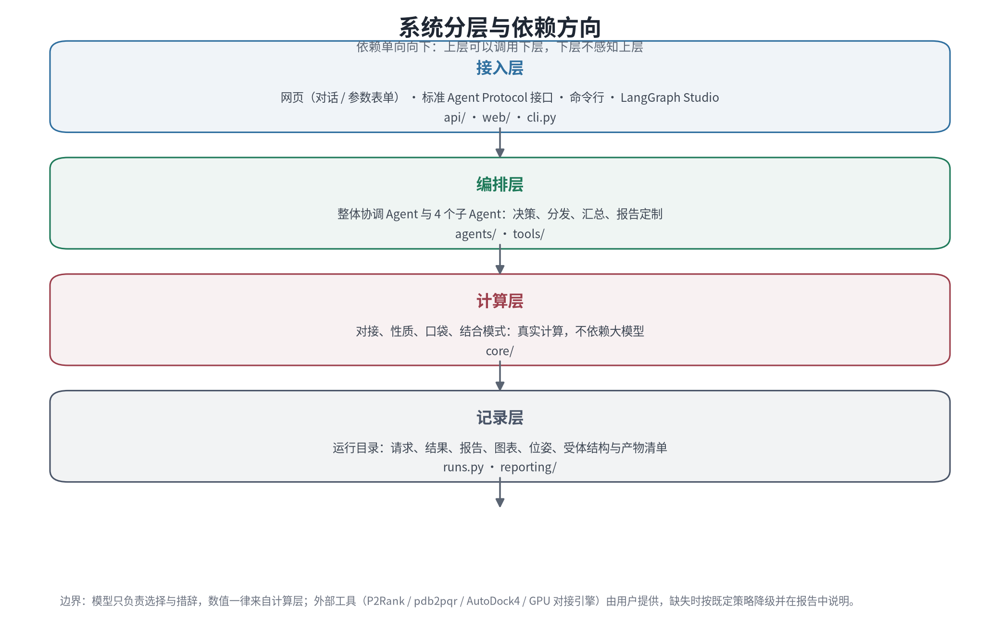
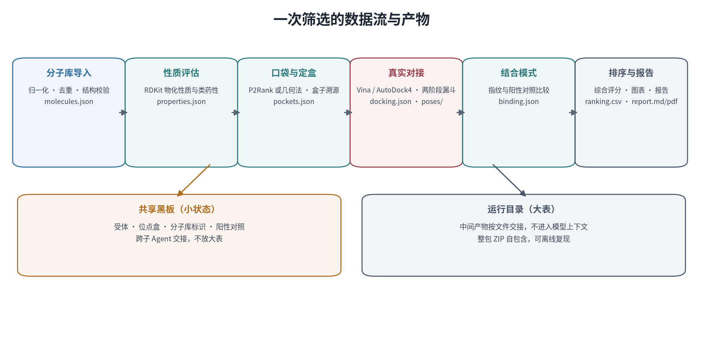

# 分子对接多 Agent 协作系统

**A multi-agent system for molecular docking-based virtual screening and binding-mode assessment**

<https://github.com/yuhao233/Docking-Multi-agent>

从自然语言指令或分子、受体文件出发，完成分子库准备、理化性质评估、结合口袋定盒、真实分子对接、
结合模式比较与推荐排序，输出可逐条核对的筛选报告与完整中间产物。

系统的分工很明确：语言模型负责判断该做什么、按什么顺序做、如何解释结果；数值一律来自计算内核。
亲和力、性质、相似度等指标均可回溯到工具输出与运行目录，模型不参与数值的生成。

`Python 3.12` · `LangChain / LangGraph` · `AutoDock Vina` · `RDKit` · `Meeko` · `GEMMI` · `FastAPI`
· 单机部署 · 离线可用 · 无外部服务依赖

---

## 目录

- [功能范围](#功能范围)
- [系统结构](#系统结构)
- [运行机理](#运行机理)
- [快速开始](#快速开始)
- [使用方式](#使用方式)
- [运行记录与可复现性](#运行记录与可复现性)
- [环境依赖与降级策略](#环境依赖与降级策略)
- [质量保障](#质量保障)
- [文档](#文档)
- [引用与许可](#引用与许可)

---

## 功能范围

| 环节 | 实现 | 产出 |
| --- | --- | --- |
| 分子库准备 | 多格式解析（SDF / SMILES / CSV / MOL2）、结构规范化、去重、ID 与来源记录 | 规范化分子库、来源清单 |
| 受体准备 | 预置受体注册表、上传结构文件、按 PDB 编号 / UniProt 登录号 / 基因名在线解析 | 对接用受体、结合位点 |
| 口袋与定盒 | P2Rank 或内置几何方法预测口袋，与实验位点比对后选定对接盒 | 口袋清单、盒子溯源 |
| 理化性质 | RDKit 计算分子量、logP、TPSA、氢键供受体、可旋转键、芳香环、类药性规则违例 | 性质表、性质分布图 |
| 分子对接 | AutoDock Vina 为主引擎，AutoDock4 备用；大库采用分阶段策略 | 亲和力、配体效率、位姿文件 |
| 结合模式 | 分子指纹、药效团锚定、结构一致性，与阳性对照比较 | 相似度、相互作用二维与三维图 |
| 报告与交付 | 固定骨架报告，可依用户对输出的要求调整；全部产物可单项或整包下载 | 报告、排序表、图表、自包含压缩包 |

## 系统结构



系统分为接入、编排、计算、记录四层，依赖单向向下。计算层不依赖语言模型，因而可以脱离智能体运行，
这既是离线能力的基础，也是测试与结果复现的基础。


一个协调智能体掌握全部工具，负责决策、分发与汇总；四个子智能体分别承担口袋分析、性质评估、
对接执行与结合模式检测，按无状态执行器设计，每次调用使用独立会话。跨步骤数据分两路交接：
受体、位点盒、分子库标识等小状态写入共享状态；分子清单、性质与对接明细落盘为运行产物并按路径交接，
因此上万条明细不进入模型上下文。

## 运行机理


用户输入先经受理层解析为结构化任务规约，给出执行、请求补充或拒绝的决策；后两种情形不调用任何计算工具，
因此不会产生空报告。随后协调智能体按规约分发工具，真实计算完成后明细落盘、摘要回传，
界面持续接收文本增量、阶段进展与领域事件，长任务不会表现为无响应。



对接是流程中的时间瓶颈，系统按可用核数规划线程与进程的比例，并在候选规模较大时先做全库粗筛、
再对头部精算，同一分子保留精度更高的一条结果。报告中固定记录实际使用的引擎、搜索强度与盒子来源，
便于确认结论的适用条件。

## 快速开始

```bash
git clone https://github.com/yuhao233/Docking-Multi-agent.git
cd Docking-Multi-agent/projects

bash scripts/doctor.sh          # 环境能力自检：缺什么、缺了会降级成什么
bash start.sh                   # 首次安装依赖并启动服务（默认 http://127.0.0.1:5000）
```

运行需要可用的模型端点（任意 OpenAI 兼容接口），复制 `.env.example` 为 `.env` 后填写。
未配置时环境自检与计算内核仍可使用，但对接流程无法编排执行。`doctor.sh` 退出码 `0` 为全能力、
`2` 为部分降级、`1` 为缺少必需组件。

## 使用方式

### 对话方式


描述目标即可执行，例如"用上传的分子库对接凝血酶，报告里带上小分子 ID"。参数区只下发被改动过的字段，
气泡下方的参数小票如实列出本次下发的参数；受体与分子库可以直接上传，也可以在指令中以 `@文件名` 引用。

### 参数方式与结果

参数方式以表单为权威输入，可显式指定受体、位点盒、分子库、引擎、搜索强度、输出位姿数、质子化态策略与阳性对照。


结果区给出关键指标、运行笔记、可排序分页的推荐排行与逐分子结构卡；报告采用固定骨架，
第 3 章中每个推荐分子附二维结构与关键指标。


界面为三栏：左栏参数设置，中栏对话与结果，右栏运行详情（编排时间轴、阶段日志、工具轨迹、
实时逐分子结果），左右栏可收起，窄屏自动降级排布。

### 历史运行

运行记录按次落盘并持久保存，关闭页面后仍可检索之前的运行：支持按关键词（运行编号、受体、
分子名称或编号）、状态、类型、受体与时间范围查询并分页，点选即载入该次运行的结果、报告与中间数据。

### 接口与平台

系统提供标准智能体协议接口与命令行入口，计算内核也可作为库直接调用。`langgraph-deploy/` 目录
把编排层暴露为六张图，可在可视化调试环境中查看状态与中断，或通过平台 SDK 调用。

## 运行记录与可复现性

```
var/runs/<run_id>/
├── run.json            运行元数据与产物清单
├── request.json        请求原文          ├── result.json        完整结果
├── ranking.csv/.json   排序结果          ├── molecules.json     分子库与来源
├── properties.json     理化性质          ├── docking.json       对接明细与参数留痕
├── pockets.json        口袋与盒子溯源    ├── blackboard.json    共享状态快照
├── report.md / .pdf    规范报告          ├── charts/            结构卡与对比图
├── poses/              配体位姿          └── receptor/          对接实际使用的受体结构
```

运行目录自包含，可整目录迁移或离线查看。同一随机种子下，单分子得分不依赖批次组成与并行方式，
因此可用相同输入与参数复算并逐条比对。

## 环境依赖与降级策略

| 组件 | 必要性 | 缺失时的行为 |
| --- | --- | --- |
| Python 3.12、RDKit、Vina 绑定、Meeko、FastAPI、Matplotlib | 必需 | 自检失败并给出安装命令 |
| 工作目录可写 | 必需 | 自检失败，需修正权限或指定工作区 |
| 模型端点 | 必需 | 无法编排对接；环境自检与计算内核仍可用 |
| Java 运行时与 P2Rank | 可选 | 口袋分析使用内置几何方法 |
| pdb2pqr | 可选 | 受体不按目标 pH 重新分配质子化态，报告注明 |
| AutoDock4 | 可选 | 仅保留主引擎 |
| 中文字体 | 可选 | 图表与 PDF 中的中文可能显示异常 |
| GPU 对接引擎 | 可选 | 由用户提供可执行文件并在设置中登记；登记后不可用时任务直接失败并提示，不回退 |

## 质量保障

| 检查 | 内容 |
| --- | --- |
| `pytest` | 计算内核、智能体契约、报告版式、接口协议、打包与自检等 600 余项，多数可离线运行 |
| `scripts/lint_local.py` | 静态规范：返回类型、静默异常、裸环境变量、文件规模 |
| `scripts/check_web.py` | 界面静态校验：DOM 契约、设计令牌、外部依赖 |
| `scripts/ui_e2e.js` | DOM 级端到端：对话、参数、结果、设置、协议帧、三栏布局 |
| `scripts/browser_check.py` | 真实浏览器：协议请求形状、报告版式、三栏布局与折叠 |
| `langgraph-deploy/scripts/check.sh` | 平台面图谱与依赖一致性，含端到端冒烟 |

## 文档

| 文档 | 内容 |
| --- | --- |
| [`docs/技术文档.md`](docs/技术文档.md) | 框架、运行原理、使用说明（含系统结构图与数据流图） |
| [`projects/README.md`](projects/README.md) | 工程主文档：全部配置项、接口契约、运行记录格式与逐轮改造记录 |
| [`projects/docs/architecture.md`](projects/docs/architecture.md) | 架构与设计决策、非目标与硬约束 |
| [`projects/docs/adr/`](projects/docs/adr/) | 架构决策记录 |
| [`projects/docs/api.md`](projects/docs/api.md) | HTTP 接口契约与流式帧格式 |

## 引用与许可

本项目以 **AGPL-3.0-or-later** 发布，全文见 [`LICENSE`](LICENSE)。选择强著佐权协议的考虑是：
系统允许被改造后作为网络服务对外提供，AGPL 的网络条款要求此类服务同样开放修改后的源码。
学术使用不受限制；如需在闭源产品中集成，请与作者联系获取商业许可。

使用本系统开展研究时，请引用本仓库，并按报告列出的工具与版本引用相应工具的文献。
依赖组件与本项目许可不冲突：多为宽松许可（Apache-2.0、BSD-3-Clause、MIT），部分为弱著佐权许可
（LGPL-2.1、MPL-2.0）。外部工具（P2Rank、pdb2pqr、AutoDock4、GPU 对接引擎）不随仓库分发，
需用户自行安装并遵循其原始许可。
