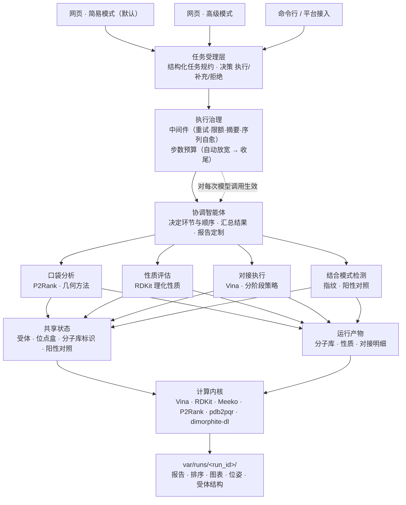

# 分子对接多 Agent 协作系统 · 技术文档

**仓库地址**：<https://github.com/yuhao233/Docking-Multi-agent>

> **文档分工**（2026-09 文档收敛）：本文是**读者向概览**——用一篇文章讲清「是什么 / 怎么运行 /
> 怎么使用」；工程细节（安装、全部配置项、接口速查、门禁验收）见
> [`projects/README.md`](../projects/README.md)，开发规范与不变量见
> [`projects/docs/architecture.md`](../projects/docs/architecture.md)，HTTP 契约见
> [`projects/docs/api.md`](../projects/docs/api.md)，含实测数据的完整技术报告见
> [`projects/docs/技术报告.md`](../projects/docs/技术报告.md)。本文不重复这些细节，只给可读的全局叙述。

---

## 摘要

本系统面向小分子筛选与结合模式评估任务，把"分子库准备—理化性质评估—结合口袋定盒—真实分子对接—结合模式比较—排序与报告"这一条实验流程交给若干协作的语言模型智能体来编排，而把全部数值计算交给确定性的计算内核。系统采用一个协调智能体加四个职能子智能体的结构，协调智能体只做决策、分发与汇总，子智能体只调用工具并返回结构化结果，真实计算由 AutoDock Vina、RDKit、Meeko 与（可选的）P2Rank 完成。所有中间结果与产物按次运行落盘，报告中的每一个数值都可以回溯到工具输出。系统提供网页界面、命令行与 HTTP 接口三种使用方式。网页界面分两套：**简易模式**（默认首页，
仅「任务描述 + 筛选结果」两块，参数由默认值与受理层自动规划）与**高级模式**（三栏工作台：
参数表单、对话与结果、运行详情，另有历史检索、报告全文与设置页），顶栏可切换。接口分为承载业务的
产品接口与遵循标准智能体协议的运行接口两组，共四十余个端点，覆盖运行发起、状态查询、产物下载与
历史检索。交互口径见 1.3：需要用户裁决的只有影响对接本身的问题，其余执行细节由系统处理。

**关键词**：分子对接；多智能体协作；虚拟筛选；可复现性；AutoDock Vina

---

## 1 系统定位与适用范围

### 1.1 要实现什么

给定一个蛋白质受体与一批候选小分子，系统完成完整的筛选与评估流程，并输出可核查的结果：

- 受体准备：从用户上传的结构文件或在线结构库（按 PDB 编号、UniProt 登录号、基因名检索）获取受体，现场制备为对接输入；受体必须由用户指定，系统**没有默认受体**（注册表预置受体仅供内部测试）；
- 结合位点：优先使用用户给定的坐标，其次使用受体的已知位点，否则由口袋预测或内置几何方法确定，并记录盒子来源与依据；
- 对接计算：以 AutoDock Vina 为主引擎，可选 AutoDock4 作为备用，支持大库的分阶段计算；
- 性质与结合模式：RDKit 计算理化性质与类药性；以分子指纹、药效团锚定与阳性对照比较刻画结合模式；
- 交付：按次运行的目录中保存报告、排序表、图表、位姿与受体结构，便于复核与复现。

### 1.2 非目标

系统不生成新分子，不进行骨架跃迁或定量构效关系建模；不实现自研对接引擎与打分函数，只对既有引擎做编排与取证；不做多用户与权限体系，默认只监听本机地址。

### 1.3 设计原则

**数值只来自计算。** 语言模型负责选择流程、解释结果与撰写文字判断，任何亲和力、性质、相似度都必须来自工具返回；模型不得推断或补全缺失数值。

**降级必须可见。** 可选组件缺失、输入被改写、分子被跳过，都会写入运行记录与报告，而不是静默替换。例如缺少质子化工具时，报告会说明受体未按目标 pH 重新分配质子化态。

**能力只有一处实现。** 同一能力不在两个地方各写一遍：编排能力集中在智能体与工具层，计算能力集中在计算内核，接口形态只有一份实现。这条约束直接影响系统的可维护性与结果一致性。

**一次运行一份记录。** 运行目录自包含，可整目录迁移；报告中的结论与产物清单一一对应。

**执行细节自主处理，用户只裁决影响对接的问题。** 需要用户决定的只有三类：受体不可用或存在多个同等
合理的候选、多组分分子的代表结构取法、共晶配体是否作为阳性对照 —— 三者都直接改变计算对象或方法学
基线，系统因此不执行计算，只下发候选项，并把选择作为请求字段在同一会话内续跑。其余情形按执行细节
处理：工具与模型的瞬时失败自动重试；达到递归上限时自动放宽（120 → 240 → 480）并从检查点续跑，
到顶由协调智能体用现有结果收尾并照常产出报告（执行类失败不向用户上报为错误）；同一问题只下发一次，
候选在本轮输出结束后才挂出；页面刷新后结果区置空，往次结果由历史运行载回。

---

## 2 总体框架

### 2.1 分层结构


依赖方向单向向下：接入层调用受理层，受理层产出任务规约交给编排层，编排层经运行支撑层调用计算层，
记录层贯穿全过程。计算层不感知语言模型的存在，因此可以脱离智能体单独运行，这既是离线能力的基础，
也是测试与复现的基础。受理层与运行支撑层是随产品演进补上的两处边界：前者把「自然语言 → 可执行规约」
的判定与工具执行解耦，后者把共享状态、产物交接、运行事实、步数预算与事件流从 Agent 代码中抽出。

<details>
<summary>协作结构的 Mermaid 版本（便于复制与二次编辑）</summary>



</details>

### 2.2 模块职责

| 层 | 主要模块 | 职责 |
| --- | --- | --- |
| 接入 | `api/`（含 `routers/`、标准协议面）、`web/`、`cli.py` | 两套网页界面、产品接口与标准智能体协议、命令行入口、安全守卫 |
| 受理 | `intake.py` | 自然语言与表单 → 任务规约与执行决策；会话继承；受体与配体的在线解析编排 |
| 编排 | `agents/` | 协调智能体、四个子智能体、工具分发、中间件治理、条件纪律段、工具调用序列自愈、结果合并 |
| 运行支撑 | `runtime/` | 事件流、共享黑板、产物落盘、运行事实、步数预算、模型构建、运行上下文与检查点 |
| 计算 | `core/`、`tools/` | 受体与配体准备、口袋与定盒、对接引擎、性质与指纹、质子化、排序；工具层是内核的智能体接口 |
| 记录 | `runs.py`、`reporting/` | 运行目录、产物登记、报告与图表、打包下载 |
| 部署 | `langgraph-deploy/` | 平台化运行（图谱定义、Studio 与 SDK 接入） |

### 2.3 两种运行形态

系统对外提供两个面。**本地产品面**是单进程服务，承载网页界面、产物下载、上传与设置，是日常使用方式；**平台面**把同一份代码暴露为若干张图，供可视化调试与编程接入使用。两者共用编排层与计算层代码，不各写一套。

---

## 3 运行原理

### 3.1 任务受理

用户输入先经过受理层，被解析为结构化任务规约：任务类型、受体来源、位点来源、对接参数、关键假设与决策。受理层给出的决策有三种——执行、请求补充信息、拒绝；后两者不会调用任何计算工具，因此不会产生空报告。

受理层的输出随消息一起交给协调智能体，智能体据此执行，不再重新解析用户语言。这一步把"理解需求"与"执行任务"分开，使参数来源与决策依据都可以在运行记录中查到。

### 3.2 协作结构


协调智能体掌握全部工具，负责判断需要哪些环节、以什么顺序执行、何时停止、结果如何组织。四个子智能体各自持有一组专用工具：

- **口袋分析**：预测结合口袋、与实验位点比对、选定对接盒并写入共享状态；
- **分子属性评估**：计算理化性质、类药性与结构规范化的相关指标；
- **对接执行**：确定受体与位点、按参数执行真实对接、按规模选择分阶段策略；
- **结合模式检测**：以指纹与药效团刻画结合模式，并与阳性对照比较。

子智能体按"无状态执行器"设计：每次调用使用独立会话，不依赖上一次的输出，因此同一轮对话中重复调用不会产生上下文串扰。跨步骤需要共享的信息一律走运行级通道。

### 3.3 一次运行的时序


一次完整运行包含九个环节：提交指令、生成任务规约、按需分发工具、真实计算、明细落盘、摘要回传、流式事件反馈、报告与产物生成、下载与回看。界面在执行过程中持续收到事件流：文本增量、阶段进展、领域事件（逐分子对接结果）、**思考增量**（单独成轨并折叠，不混进正文）与**步数预算事件**（自动放宽或收尾时如实告知）。需要用户决定的候选选项在本轮输出结束后才挂出，避免与进行中的运行抢跑；长任务因此既不会表现为无响应，也不会在执行细节上打扰用户。

### 3.4 数据交接


协作中的数据分两类处理。**小状态**（受体、位点盒、分子库标识、阳性对照）写入共享状态，供各子智能体读取；**大表**（分子清单、性质明细、对接明细）落盘为运行产物，按文件路径交接。后一条是系统能处理上万条分子的前提：明细不进入模型上下文，模型只读摘要与排序，完整数据由计算内核与报告层直接消费。

### 3.5 计算与并行

对接是流程中唯一的时间瓶颈，系统对此做两件事。

其一是**按机器规划并行度**。单分子搜索可借线程加速，但存在饱和点；多进程又要为每个进程重复构建网格图并争抢内存带宽。系统先按可用核数（并考虑容器配额与 CPU 亲和性）确定线程数，再用进程数填满剩余算力，并预留一个核给服务本身。

其二是**两阶段筛选**。候选规模超过阈值时，先以较低搜索强度完成全库粗筛，再对头部分子以更高强度精算；同一分子若两轮都有结果，保留精度更高的一条，粗筛分数单独保留以便比较。这一策略在精度与总耗时上都优于对全库统一使用高搜索强度。

### 3.6 报告与可追溯性

报告采用固定骨架：系统与参数摘要、结果排序、推荐分子、理化性质、结合模式、方法与局限、失败与跳过、结论与建议、产物清单。第 3 章中每个推荐分子附一张结构卡，左侧为二维结构，右侧为该分子的关键指标。

除固定骨架外，协调智能体可以在不改变骨架的前提下按用户对输出的要求做调整（标题、附加列、要点），并把"用户要求与实际处理"记录在报告开头一节；若某项要求无法满足（例如输入文件不含所要求的字段），工具会回报覆盖率，模型必须如实说明，报告相应标注。运行记录同时保存实际使用的引擎与版本，跨引擎的分数不会被混入同一排序。

---

## 4 使用说明

### 4.1 安装与环境自检

```bash
git clone https://github.com/yuhao233/Docking-Multi-agent.git
cd Docking-Multi-agent/projects
bash scripts/doctor.sh          # 环境能力自检：有什么、缺什么、缺了什么会降级
bash start.sh                   # 首次安装依赖并启动服务
```

`doctor.sh` 逐项检查运行环境并给出结论：必需组件缺失时以非零状态退出并给出补齐命令；可选组件缺失时说明相应能力如何降级。服务启动后默认地址为 `http://127.0.0.1:5000`，端口被占用时自动顺延。默认只监听本机；若需在同一网段的其他机器上使用，把 `HOST` 设为 `0.0.0.0` 后重启，其他机器通过`http://<本机局域网 IP>:<端口>` 访问。服务不带鉴权，开放到局域网等于把全部运行结果、上传入口与设置项（含模型密钥）交给同网段的所有人，仅建议在可信网络中这样做。运行需要可用的模型端点（任意 OpenAI 兼容接口），配置项写入 `.env`。

### 4.2 两套界面

| 界面 | 地址 | 形态 |
| --- | --- | --- |
| 简易模式（默认） | `/`（别名 `/simple`） | 只有「任务描述 + 筛选结果」两块，零参数表单；参数由默认值与受理层自动规划决定；结果区给前几名、关键指标与产物链接 |
| 高级模式 | `/advanced` | 三栏工作台（参数表单 / 对话与结果 / 运行详情），含历史检索、报告全文、中间数据与设置页 |

两套界面走同一条标准智能体协议链路与同一批产物接口，结果完全一致，只是暴露的操作面不同。
对话区的呈现遵循同一套约定：回复按 Markdown 渲染（含 HTML 先转义与链接方案白名单），流式阶段
即为渲染后的样子；模型的思考过程收进气泡内默认收起的「思考」块（推理时展开可见，正文一到即自动
收起并记用时）；助手回执不做默认折叠；需要用户决定的候选选项在本轮输出结束后才挂出。

### 4.3 对话方式


在输入框描述目标即可，例如"用上传的分子库对接凝血酶，报告里带上小分子 ID"。运行参数区只下发被改动过的字段，其余按系统默认或自动规划执行，气泡下方的参数小票如实列出本次下发的参数。受体与分子库可以直接上传，也可以在指令中以 `@文件名` 引用已上传文件。**受体与分子库是必需项**：未指定受体时系统**只提问、零计算**（给出 PDB 编号 / UniProt 登录号 / 受体名称 / 上传结构文件三条出路），**不存在默认受体**；未给出分子来源且未明确同意用示例库时同样只提问。点名受体时系统先做在线解析，存在多个合理候选时给出可选项而不代为决定。

### 4.4 参数方式

参数方式以表单为权威输入，可显式指定受体、位点盒、分子库、引擎、搜索强度、输出位姿数、质子化态策略与阳性对照。搜索强度提供三档预设；位点盒留空时由口袋分析确定；阳性对照留空时跳过对照分析，报告相应注明。无论哪种输入方式，执行都由同一套编排逻辑完成，因此结果结构与产物组织保持一致。

### 4.5 结果与报告


结果区给出关键指标、运行笔记、可排序分页的推荐排行与逐分子结构卡。运行笔记记录本次运行中的降级、跳过与假设，可展开查看全文（对话气泡则不做默认折叠）。报告可导出为 PDF，排序表与全部中间数据可单独下载，也可打包为自包含压缩包。


界面为三栏：左栏参数设置，中栏对话与结果，右栏运行详情（编排时间轴、阶段日志、工具轨迹与实时逐分子结果）。左右栏可收起，窄屏自动降级排布。

### 4.6 历史运行检索与复用

运行记录按次落盘并持久保存，因此**关闭页面后仍可查回之前的运行**。历史区支持按关键词（运行编号、受体、分子名称或编号）、状态、类型、受体与时间范围检索并分页；点选任意一条即可载入该次运行的结果、报告与中间数据。索引在使用时建立，数千条记录下首次检索为亚秒级。

### 4.7 编程接口

服务启动后即暴露 HTTP 接口，默认只监听本机地址，不带鉴权，适合本机脚本与内网部署。接口分为两组：
**产品接口**（`/api/...`）承载业务流程与产物访问；**运行接口**（`/threads`、`/runs`、`/assistants`）
遵循标准智能体协议，用于发起与跟踪一次运行。两组接口共享同一套编排与计算实现。

#### 4.6.1 运行接口

| 方法 | 路径 | 用途 |
| --- | --- | --- |
| `POST` | `/threads` | 创建会话线程（同一线程即同一段对话） |
| `POST` | `/threads/{thread_id}/runs/stream` | 在线程上执行并以事件流返回 |
| `POST` | `/threads/{thread_id}/runs/wait` | 在线程上执行并等待最终结果 |
| `POST` | `/threads/{thread_id}/runs/{run_id}/cancel` | 取消运行（协作式，会终止对接进程池） |
| `GET` | `/threads/{thread_id}/state`、`/history` | 线程当前状态与检查点历史 |
| `POST` | `/runs/stream`、`/runs/wait` | 无状态执行（不保留多轮上下文） |
| `GET` | `/assistants/search`、`/assistants/{id}/schemas` | 列出可用助手与其输入输出结构 |

请求体为标准信封，业务参数放在 `input` 内。`assistant_id` 取 `coordinator`（编排主入口）；
`input.mode` 为 `chat`（自然语言）或 `manual`（表单参数为权威）。事件流的帧类型包括
`metadata`（运行标识）、`messages/partial`（文本增量）、`messages/complete`（最终文本）、
`updates`（节点更新）、`custom`（领域事件，如阶段进展与逐分子对接结果）、`values`（最终值）、
`error` 与 `end`。

```bash
# 建立会话
curl -s -X POST localhost:5000/threads -H 'Content-Type: application/json' -d '{}'
# → {"thread_id": "..."}

# 发起运行并消费事件流
curl -N -X POST localhost:5000/threads/<thread_id>/runs/stream \
     -H 'Content-Type: application/json' \
     -d '{"assistant_id":"coordinator","stream_mode":["messages","updates","custom"],
          "input":{"mode":"chat","message":"用上传的分子库对接凝血酶，报告里带上小分子 ID"}}'
```

#### 4.6.2 产品接口

| 分组 | 端点 | 用途 |
| --- | --- | --- |
| 运行与产物 | `GET /api/runs`、`/api/runs/{run_id}` | 运行列表与检索、单次运行详情 |
| | `GET /api/runs/{run_id}/ranking` | 排序结果分页查询 |
| | `GET /api/runs/{run_id}/artifacts/{name}` | 单个产物下载（报告、图表、位姿等） |
| | `GET /api/runs/{run_id}/report.pdf`、`/export.csv`、`/poses.zip`、`/download.zip` | 报告、排序表、位姿与整包下载 |
| | `POST /api/runs/{run_id}/cancel` | 取消运行 |
| 输入 | `POST /api/uploads`、`/api/uploads/inspect` | 上传分子库或受体文件、检查文件可解析性 |
| | `GET /api/libraries`、`/api/receptors` | 可用示例库；受体注册表（`/api/receptors` 为**内部/诊断**端点，响应带 `"internal": true`，网页界面不再调用，也不是用户可选来源） |
| | `GET /api/molecule/depict`、`/api/molecule/properties` | 分子二维结构图与理化性质 |
| 配置 | `GET`/`PUT /api/settings`、`POST /api/settings/test`、`/reset`、`/reload` | 读取与保存设置、测试模型连通性 |
| | `POST /api/tools/probe` | 探测外部工具（口袋预测、受体质子化 pdb2pqr、配体 pKa 引擎、外部对接引擎） |
| 系统 | `GET /api/health`、`/api/models` | 服务状态与可用模型清单 |

运行检索接口在前面 §4.5 已给出示例；产物下载接口返回的 `Content-Disposition` 采用规范文件名，
同一份产物在界面、脚本与压缩包中名称一致。

#### 4.6.3 错误与兼容

接口错误使用标准 `detail` 字段返回说明；少数早期端点同时附带 `error_message` 字段以便老脚本读取。
已被取代的端点保留但标注为废弃，新客户端应使用标准运行接口。接口与网页界面调用同一实现，
因此界面能看到的降级、跳过与失败原因，接口调用方同样能在运行记录中读到。

命令行入口提供受体清单、运行记录查询与服务启动等子命令；计算内核亦可作为库直接调用，
用于批量脚本与参数扫描。

### 4.8 平台化运行

`langgraph-deploy/` 目录把编排层暴露为六张图（协调智能体、受理层、四个子智能体），可在可视化调试环境中直接对话、查看状态与中断，也可通过平台 SDK 调用。平台化运行与本地服务共用同一份代码，区别只在持久化由平台托管。

---

## 5 运行记录与可复现性

### 5.1 目录结构

```
var/runs/<run_id>/
├── run.json            运行元数据与产物清单
├── request.json        请求原文
├── result.json         完整结果
├── ranking.csv/.json   排序结果
├── molecules.json      分子库与来源信息
├── properties.json     理化性质
├── docking.json        对接明细（能量项、盒子来源、参数留痕）
├── pockets.json        口袋预测与对接盒溯源
├── blackboard.json     共享状态快照
├── report.md / .pdf    规范报告
├── charts/             结构卡、姿态图与对比图
├── poses/              配体位姿
└── receptor/           对接实际使用的受体结构
```

目录自包含：复制到另一台机器即可离线查看结果，压缩包中包含报告、排序表、图表、位姿与受体结构。

### 5.2 复现一次运行

同一次运行使用相同的随机种子，单分子得分不依赖于批次组成与并行方式，因此可用相同输入与参数复算并逐条比对。报告与排序表记录了实际使用的引擎、搜索强度与位点盒来源，便于确认复现条件是否一致。

### 5.3 环境依赖与降级

| 组件 | 必要性 | 缺失时的行为 |
| --- | --- | --- |
| Python 3.12 与核心依赖 | 必需 | 自检失败并给出安装命令 |
| 工作目录可写 | 必需 | 自检失败，需修正权限或指定工作区 |
| 模型端点 | 必需 | 无法编排对接流程；环境自检与计算内核仍可用 |
| Java 运行时与 P2Rank | 可选 | 口袋分析使用内置几何方法 |
| pdb2pqr | 可选 | 受体不按目标 pH 重新分配质子化态，报告注明 |
| Dimorphite-DL（配体 pKa 引擎） | 可选 | 配体 pH 处理回退内置 pKa 规则表（近似），报告与运行记录注明回退原因与安装方法 |
| AutoDock4 | 可选 | 仅保留主引擎 |
| 中文字体 | 可选 | 图表与 PDF 中的中文可能显示异常 |
| GPU 对接引擎 | 可选 | 由用户提供可执行文件并在设置中登记；登记后不可用时任务直接失败并提示，不回退 |

---

## 6 方法与局限

### 6.1 打分与搜索的近似性

对接得分来自经验打分函数与启发式搜索，不是结合自由能的实验测量值。排序用于在同一受体、同一参数条件下比较候选分子，不宜跨受体或跨参数直接比较。系统在报告中固定记录参数与盒子来源，正是为了让这种比较的适用条件可查。

### 6.2 质子化与特殊化学

理化性质与对接必须使用同一种化学形式。受体与配体都按**同一目标 pH** 处理，且两侧各用专业工具：受体侧用 pdb2pqr 结合 PROPKA 的逐残基 pKa 判定重新分配质子化态；配体侧默认使用 Dimorphite-DL（RDKit 的 pKa 规则库）枚举可电离官能团的微观态。系统提供运行级质子化态策略：按目标 pH 分配、仅中和带净电荷的分子、或保持输入形式。同一分子在目标 pH 附近可能存在多个微观态时，系统按固定规则选定其中一个形式对接，并把全部候选与选择规则写入运行产物，报告中同时声明未做微观态布居与能量比较。金属辅因子、盐的反离子、多组分配体等特殊情形按保守规则处理，实际参与对接的化学形式逐分子记录，并在报告中说明；缺失专业配体引擎时自动回退内置 pKa 规则表（近似口径）并如实注明。

### 6.3 引擎可比性

不同引擎与不同执行后端（CPU 与 GPU）在搜索策略与数值精度上存在差异，同一次排序中不混用引擎。配体统一按刚性大环准备（不切环、不采样环构象），以保证与经典 AutoDock 格点打分兼容。默认引擎为 `auto`：优先内置 Vina，不可用时回退经典 AutoDock4（CPU）。用户也可在设置中登记本机安装的 GPU 对接工具并把「对接引擎」设为 `external`，此时对接由该外部引擎执行（当前已接入执行适配的是 AutoDock-GPU 与 CPU 版 Vina 命令行），结果行与报告中记录实际引擎及其版本。若配置了外部引擎但不可用，系统拒绝启动并给出提示，而不是改用其他实现后照常出结果；登记了外部引擎而本次未选用时，运行笔记会明确说明本次仍由内置引擎计算。

### 6.4 已知限制

大规模库的耗时主要取决于候选数量、搜索强度与位点盒体积；两阶段策略缓解但不能消除这一代价。受体准备依据标准流程保留蛋白质原子，体系若依赖被剔除的辅因子，需要用户显式指定保留或自行提供已制备的受体文件。系统不提供多用户隔离与权限管理。

---

## 7 工程保障

系统维护一组自动化检查，覆盖计算内核、智能体契约、报告版式、接口协议、步数预算与工具调用序列自愈、界面行为与部署配置。计算与接口相关的检查在离线环境即可完成；界面检查包含静态契约校验（界面结构、设计令牌、候选交互时序）、DOM 级端到端验证与真实浏览器验证，后者用于确认标准协议下的请求形状、Markdown 渲染、思考折叠、候选点选时机与运行态、报告版式。当前本机全量为 853 项通过（离线快跑 599 通过、253 跳过）。持续集成流水线（`.github/workflows/gate.yml`）在每次提交时运行静态门禁与离线用例；需要本机真实引擎（对接、口袋预测、质子化）的用例由 `DOCKING_ENGINE_TESTS` 开关分层，在具备引擎的机器上全量执行。文档与由它生成的 PDF/Word 之间用内容哈希核对，源变更后未重出产物会被门禁拦下。

外部工具不在仓库内分发：体积较大的工具由脚本按需获取，需要用户自备的工具在设置中登记路径。登记后的工具会被探测（可执行性、版本、设备可见性），探测结论在设置界面、自检脚本与运行记录中保持一致。

服务定位为本机工具，默认只监听回环地址且不带鉴权。在此前提下另设若干与监听地址无关的守卫：写操作的同源校验、内容安全策略与安全响应头、运行/线程/会话标识符的白名单校验，以及"校验已上传文件"端点对上传目录的限定。这些措施降低误暴露的代价，但不替代鉴权。

---

## 8 引用与许可

### 8.1 接口契约

本文只给出接口分组与调用方式；完整的端点清单、请求/响应字段与事件流帧格式见
[`projects/docs/api.md`](../projects/docs/api.md)，该文件与实现同步维护。

### 8.2 引用

使用本系统开展研究时，请引用本仓库，并按报告第 1 节列出的工具与版本，同时引用相应工具的文献（对接引擎、化学信息学工具包、口袋预测方法等）。

### 8.3 许可

本项目以 **AGPL-3.0-or-later** 发布，全文见仓库根目录 `LICENSE`。选择强著佐权协议的考虑是：系统允许被改造后作为网络服务对外提供，AGPL 的网络条款要求此类服务同样开放修改后的源码。学术使用不受限制；如需在闭源产品中集成，请与作者联系获取商业许可。

仓库不随附第三方工具与模型权重，各依赖组件遵循其原始许可。系统安装的依赖多为宽松许可（Apache-2.0、BSD-3-Clause、MIT），部分为弱著佐权许可（LGPL-2.1、MPL-2.0），与本项目的许可选择不冲突。
